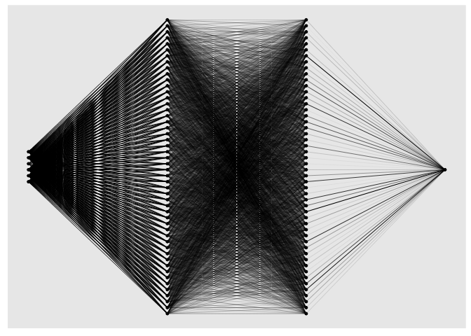

<!-- README.md is generated from README.Rmd. Please edit that file -->

# cito

[](https://www.repostatus.org/#active)
[](https://www.gnu.org/licenses/gpl-3.0)
[](https://cran.r-project.org/package=cito)
[](https://github.com/citoverse/cito/actions/workflows/R-CMD-check.yaml)
[](https://doi.org/10.1111/ecog.07143)

<!-- badges: end -->

The ‘cito’ package provides a user-friendly interface for training and
interpreting deep neural networks (DNN). ‘cito’ simplifies the fitting
of DNNs by supporting the familiar formula syntax, hyperparameter tuning
under cross-validation, and helps to detect and handle convergence
problems. DNNs can be trained on CPU, GPU and MacOS GPUs. In addition,
‘cito’ has many downstream functionalities such as various explainable
AI (xAI) metrics (e.g. variable importance, partial dependence plots,
accumulated local effect plots, and effect estimates) to interpret
trained DNNs. ‘cito’ optionally provides confidence intervals (and
p-values) for all xAI metrics and predictions. At the same time, ‘cito’
is computationally efficient because it is based on the deep learning
framework ‘torch’. The ‘torch’ package is native to R, so no Python
installation or other API is required for this package.

## Installation

Before installing ‘cito’ make sure ‘torch’ is installed. See the code
chunk below if you are unsure on how to check this

``` r
# check package 
if(!require('torch',quietly = TRUE)) install.packages('torch')
library('torch') 

#install torch
if(!torch_is_installed()) install_torch()
```

If you have trouble installing ‘torch’, please [visit the website of the
‘torch’
package](https://torch.mlverse.org/docs/articles/installation.html) or
create an issue on [our github
website](https://github.com/citoverse/cito/issues). We are happy to help
you.

A stable version of cito from CRAN can be installed with:

``` r
install.packages("cito")
```

The development version from [GitHub](https://github.com/) can be
installed by:

``` r
if(!require('devtools', quietly = TRUE)) install.packages('devtools')
devtools::install_github('citoverse/cito')
```

## Example

Once installed, the main function `dnn()` can be used. See the example
below. A more in depth explanation can be found in the vignettes or
[here under articles](https://citoverse.github.io/cito/).

1.  Fit model with bootstrapping (to obtain confidence intervals). All
    methods work with and without bootstrapping

``` r
library(cito)
nn.fit <- dnn(Sepal.Length~., data = datasets::iris, bootstrap = 30L)
```

2.  Check if models have converged (compare training loss against
    baseline loss (=intercept only model)):

``` r
analyze_training(nn.fit)
# At 1st glance, the networks converged since the loss is lower than the baseline loss and the training loss is on a plateau at the end of the training.
```

3.  Plot model architecture

``` r
plot(nn.fit)
```

<!-- -->

4.  ‘cito’ supports many advanced functionalities such as common
    explainable AI metrics that can be used for inference (i.e. to
    interpret the models). Variable importance (similar to a variation
    partitioning) and linear effects are directly returned by the
    `summary` function:

``` r
summary(nn.fit)
## Summary of Deep Neural Network Model
## 
## ── Feature Importance
##                 Importance Std.Err Z value Pr(>|z|)  
## Sepal.Width →        0.897   0.443    2.02    0.043 *
## Petal.Length →      20.428   8.032    2.54    0.011 *
## Petal.Width →        0.695   0.690    1.01    0.314  
## Species →            0.647   0.634    1.02    0.307  
## ---
## Signif. codes:  0 '***' 0.001 '**' 0.01 '*' 0.05 '.' 0.1 ' ' 1
## 
## ── Average Conditional Effects
##                     ACE Std.Err Z value Pr(>|z|)    
## Sepal.Width →    0.4838  0.0873    5.54    3e-08 ***
## Petal.Length →   0.6485  0.0745    8.71   <2e-16 ***
## Petal.Width →   -0.2264  0.1335   -1.70     0.09 .  
## ---
## Signif. codes:  0 '***' 0.001 '**' 0.01 '*' 0.05 '.' 0.1 ' ' 1
## 
## ── Standard Deviation of Conditional Effects
##                    ACE Std.Err Z value Pr(>|z|)    
## Sepal.Width →   0.0657  0.0176    3.73  0.00019 ***
## Petal.Length →  0.0503  0.0178    2.83  0.00467 ** 
## Petal.Width →   0.0382  0.0139    2.75  0.00596 ** 
## ---
## Signif. codes:  0 '***' 0.001 '**' 0.01 '*' 0.05 '.' 0.1 ' ' 1
```

5.  Predict (with confidence intervals):

``` r
dim(predict(nn.fit, newdata = datasets::iris))
## [1] 150   1
```

### Hyperparameter tuning

Certain arguments/parameters such as the architecture, activation
function, and the learning rate can be automatically tuned under
crossvalidation (for a full list, see `?dnn`). Parameters that should be
tuned, can be flagged by using the function `tune()` instead of a
hyperparameter value:

``` r
nn.fit <- dnn(Sepal.Length~., data = datasets::iris, lr = tune(0.0001, 0.1))
## Starting hyperparameter tuning...
## Fitting final model...
nn.fit$tuning
## # A tibble: 10 × 5
##    steps    test train models      lr
##    <int>   <dbl> <dbl> <lgl>    <dbl>
##  1     1 Inf         0 NA     0.0155 
##  2     2 Inf         0 NA     0.0993 
##  3     3   0.553     0 NA     0.00393
##  4     4 Inf         0 NA     0.0817 
##  5     5 Inf         0 NA     0.0179 
##  6     6 Inf         0 NA     0.0947 
##  7     7 Inf         0 NA     0.0176 
##  8     8 Inf         0 NA     0.0241 
##  9     9 Inf         0 NA     0.0817 
## 10    10 Inf         0 NA     0.0337
```

The tuning can be configured with `tuning=config_tuning()`. After
tuning, a final model trained with the best hyperparameters is returned.
Hyperparameter combinations that do not achieve a loss below the
baseline loss will be aborted early and not fully cross-validated. These
runs are given a test loss of infinity.

## Advanced

We can pass custom loss functions to ‘cito’, optionally with additional
parameters that should be fitted. The only requirement is that all
calculations must be written using the ‘torch’ package (cito
automatically converts the initial values of the custom parameters to
‘torch’ objects).

We use a multivariate normal distribution as the likelihood function and
we want to parameterize/fit the covariance matrix of the multivariate
normal distribution:

1.  We need one helper function, `create_cov()` that builds the
    covariance matrix based on a lower triangular matrix and the
    diagonals (low-rank approximation of the covariance matrix)

2.  We need our custom likelihood function which uses the
    `distr_multivariate_normal(…)` function from the torch package:

``` r
create_cov = function(L, Diag) {
  return(torch::torch_matmul(L, L$t()) + torch::torch_diag(Diag$exp()+0.001))
}

custom_loss_MVN = function(true, pred) {
  Sigma = create_cov(SigmaPar, SigmaDiag)
  logLik = torch::distr_multivariate_normal(pred,
                                            covariance_matrix = Sigma)$
    log_prob(true)
  return(-logLik$mean())
}
```

3.  We use “SigmaPar” and “SigmaDiag” as parameters that we want to
    optimize along the DNN. We will pass a named list with starting
    values to ‘cito’ and ‘cito’ will infer automatically (based on the R
    shape) the shape of the parameters:

``` r
nn.fit<- dnn(cbind(Sepal.Length, Sepal.Width, Petal.Length)~.,
             data = datasets::iris,
             lr = 0.01,
             epochs = 200L,
             loss = custom_loss_MVN,
             verbose = FALSE,
             plot = FALSE,
             custom_parameters =
               list(SigmaDiag =  rep(0, 3), # Our parameters with starting values
                    SigmaPar = matrix(rnorm(6, sd = 0.001), 3, 2)) # Our parameters with starting values
)
```

Estimated covariance matrix:

``` r
as.matrix(create_cov(nn.fit$loss$parameter$SigmaPar,
                     nn.fit$loss$parameter$SigmaDiag))
##            [,1]       [,2]       [,3]
## [1,] 0.26974857 0.06961995 0.11768616
## [2,] 0.06961995 0.12192857 0.04327871
## [3,] 0.11768616 0.04327871 0.15618347
```

Empirical covariance matrix:

``` r
cov(predict(nn.fit) - nn.fit$data$Y)
##            [,1]       [,2]      [,3]
## [1,] 0.23646916 0.06383643 0.1227149
## [2,] 0.06383643 0.08887552 0.0185613
## [3,] 0.12271493 0.01856130 0.1308537
```
