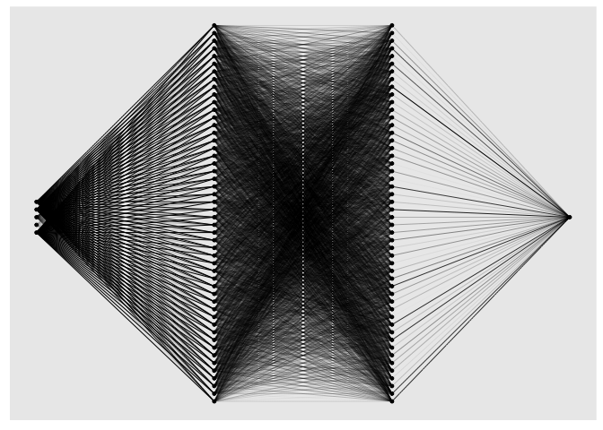

<!-- README.md is generated from README.Rmd. Please edit that file -->

# cito

[](https://www.repostatus.org/#active)
[](https://www.gnu.org/licenses/gpl-3.0)
[](https://cran.r-project.org/package=cito)
[](https://github.com/citoverse/cito/actions)

<!-- badges: end -->

‘cito’ aims at helping you build and train Neural Networks with the
standard R syntax. It allows the whole model creation process and
training to be done with one line of code. Furthermore, all generic R
methods such as print or plot can be used on the created object. It is
based on the ‘torch’ machine learning framework which is available for
R. Since it is native to R, no Python installation or any further API is
needed for this package.

## Installation

Before installing ‘cito’ make sure ‘torch’ is installed. See the code
chunk below if you are unsure on how to check this

``` r
# check package 
if(!require('torch',quietly = TRUE)) install.packages('torch')
library('torch') 

#install torch
if(!torch_is_installed()) install_torch()
```

If you have trouble installing ‘torch’, please [visit their
website](https://torch.mlverse.org/docs/articles/installation.html) or
create an issue on [our github
website](https://github.com/citoverse/cito/issues). We are happy to
help.

A stable version of cito from CRAN can be installed with:

``` r
install.packages("cito")
```

The development version from [GitHub](https://github.com/) is available
with:

``` r
if(!require('devtools', quietly = TRUE)) install.packages('devtools')
devtools::install_github('citoverse/cito')
```

## Example

Once installed, the main function `dnn()` can be used. See the example
below. A more in depth explanation can be found in the vignettes.

1.  Fit model with bootstrapping (for uncertainties)

``` r
library(cito)
nn.fit <- dnn(Sepal.Length~., data = datasets::iris, bootstrap = 30L)
```

2.  Check if models have converged (compare training loss against
    baseline loss (=intercept only model)):

``` r
analyze_training(nn.fit)
# At 1st glance they are converged since their loss is lower than the baseline loss.
```

3.  Plot model architecture

``` r
plot(nn.fit)
```

<!-- -->

4.  Return xAI effects and their uncertainties:

``` r
summary(nn.fit)
```

    ## Summary of Deep Neural Network Model
    ## 
    ##  ##########################################################
    ##      Feature Importance 
    ##  ##########################################################
    ##                          Importance Std.Err Z value Pr(>|z|)   
    ## Response_1: Sepal.Width       1.782   0.688    2.59   0.0096 **
    ## Response_1: Petal.Length     20.415   8.067    2.53   0.0114 * 
    ## Response_1: Petal.Width       0.659   0.661    1.00   0.3188   
    ## Response_1: Species           0.405   0.235    1.73   0.0842 . 
    ## ---
    ## Signif. codes:  0 '***' 0.001 '**' 0.01 '*' 0.05 '.' 0.1 ' ' 1
    ## 
    ## 
    ##  ##########################################################
    ##      Average Conditional Effects 
    ##  ##########################################################
    ##                              ACE Std.Err Z value Pr(>|z|)    
    ## Response_1: Sepal.Width   0.7443  0.0534   13.93   <2e-16 ***
    ## Response_1: Petal.Length  0.6625  0.0733    9.04   <2e-16 ***
    ## Response_1: Petal.Width  -0.1866  0.1137   -1.64      0.1    
    ## ---
    ## Signif. codes:  0 '***' 0.001 '**' 0.01 '*' 0.05 '.' 0.1 ' ' 1
    ## 
    ## 
    ##  ##########################################################
    ##      Standard Deviation of Conditional Effects 
    ##  ##########################################################
    ##                             ACE Std.Err Z value Pr(>|z|)   
    ## Response_1: Sepal.Width  0.1524  0.0481    3.17   0.0015 **
    ## Response_1: Petal.Length 0.1263  0.0452    2.80   0.0052 **
    ## Response_1: Petal.Width  0.0414  0.0215    1.93   0.0539 . 
    ## ---
    ## Signif. codes:  0 '***' 0.001 '**' 0.01 '*' 0.05 '.' 0.1 ' ' 1

5.  Predict (with confidence intervals):

``` r
dim(predict(nn.fit, newdata = datasets::iris))
```

    ## [1]  30 150   1
