## Setup - Installing torch

Before using 'cito' make sure that the current version of 'torch' is installed and running.

``` r
if(!require(torch)) install.packages("torch")
library(torch)
if(!torch_is_installed()) install_torch()

library (cito)
```

If you have problems installing Torch, check out the [installation help from the torch developer](https://torch.mlverse.org/docs/articles/installation.html).

## Details about the internal implementation of ‘cito’

### Internal Data Representation

Tabular data are typically supplied to cito as a data.frame in the usual encoding via the data argument. Categorical data are processed internally using the model.matrix functions from the R 'stats' package. Categorical features are automatically one-hot encoded (no reference level). The data are then split into a feature matrix (variables) and a response matrix.

The training of the neural networks is based on stochastic gradient descent, which involves sampling random batches of data at each optimization step. To optimize the sampling and subsetting of the data, 'torch' provides optimized data loader objects that create data iterators (objects that iterate once over the data set corresponding to an epoch). The feature and response matrices are passed to 'torch' data loaders that reside on the CPU (to avoid memory overflows on the GPU, if available).

### Construction of the neural networks

Neural networks (NN) are built using the 'nn_sequential' object from the 'torch' package. nn_sequential' expects a list of layers and then returns a fully functional neural network object. It also initializes all weights of the layers. The list of layers is built based on user input, in particular the hidden argument for the number and size of hidden layers, and the activation argument for the corresponding activation layers.

### Training and Evaluation

Once the NN structure and data are prepared, the actual training starts (the baseline loss is also calculated before the training starts). The training consists of two loops. An outer loop for the number of epochs (one epoch means that the data has been used once to update the weights). And an inner loop for the stochastic gradient descent, i.e. for n = 100 observations and batch size = 20, it takes 5 batches of data to traverse the dataset once.

At each step of the inner loop, the optimizer is reset, a batch of data is returned from the data iterator (initialized at each epoch by the data loader), split into feature and response tensors, pushed to the GPU (if one is available), the feature matrix is passed to the NN for prediction, the average loss is computed based on the response tensor and the predictions, the average loss is backpropagated, and the weights are updated by the optimizer based on the back-propagated errors. This inner loop is repeated until the dataset has been used once, completing the epoch. The process is then repeated for n epochs.

If validation is turned on, after each epoch the model is evaluated on the validation holdout (which was separated from the data at the beginning).

### Transferability

To make the model portable (e.g. save and reload the model), the weights are stored as R matrices in the final object of the 'dnn' function. This is necessary because the 'torch' objects are just pointers to the corresponding data structures. Naively, storing these pointers is pointless, because after the R session ends, the memory is freed and the pointers are meaningless.

## Introduction to models and model structures

### Loss functions / Likelihoods

Cito can handle many different response types. Common loss functions from ML but also likelihoods for statistical models are supported:

|                 |                              |                                                                          |                                                             |
|:----------------|:-----------------------------|:-------------------------------------------------------------------------|-------------------------------------------------------------|
| Name            | Explanation                  | Example / Task                                                           | Meta-Code                                                   |
| `mse`           | mean squared error           | Regression, predicting continuous values                                 | `dnn(Sepal.Length~., ..., loss = "mse")`                    |
| `mae`           | mean absolute error          | Regression, predicting continuous values                                 | `dnn(Sepal.Length~., ..., loss = "msa")`                    |
| `softmax`       | categorical cross entropy    | Multi-class, species classification                                      | `dnn(Species~., ..., loss = "softmax")`                     |
| `cross-entropy` | categorical cross entropy    | Multi-class, species classification                                      | `dnn(Species~., ..., loss = "cross-entropy")`               |
| `gaussian`      | Normal likelihood            | Regression, residual error is also estimated (similar to `stats::lm()`)  | `dnn(Sepal.Length~., ..., loss = "gaussian")`               |
| `binomial`      | Binomial likelihood          | Classification/Logistic regression, mortality (0/1 data)                 | `dnn(Presence~., ..., loss = "Binomial")`                   |
| `poisson`       | Poisson likelihood           | Regression, count data, e.g. species abundances                          | `dnn(Abundance~., ..., loss = "Poisson")`                   |
| `nbinom`        | Negative Binomial Likelihood | Regression, count data, e.g. species abundances with variable dispersion | `dnn(Abundance~., ..., loss = "nbinom")`                    |
| `mvp`           | Multivariate probit model    | Joint Species Distribution model                                         | `dnn(cbind(Species1, Species2, Species3)~,..., loss="mvp")` |

Moreover, all non multilabel losses (all except for softmax or cross-entropy) can be modeled as multilabel using the cbind syntax

`dnn(cbind(Sepal.Length, Sepal.Width)~., …, loss = "mse")`

The likelihoods (Gaussian, Binomial, and Poisson) can be also passed as their stats equivalents:

`dnn(Sepal.Length~., ..., loss = stats::gaussian)`

### Data

In this vignette, we will work with the irirs dataset and build a regression model.

``` r
data <- datasets::iris
head(data)
#>   Sepal.Length Sepal.Width Petal.Length Petal.Width Species
#> 1          5.1         3.5          1.4         0.2  setosa
#> 2          4.9         3.0          1.4         0.2  setosa
#> 3          4.7         3.2          1.3         0.2  setosa
#> 4          4.6         3.1          1.5         0.2  setosa
#> 5          5.0         3.6          1.4         0.2  setosa
#> 6          5.4         3.9          1.7         0.4  setosa

#scale dataset
data <- data.frame(scale(data[,-5]),Species = data[,5])
```

### Fitting a simple model

In 'cito', neural networks are specified and fitted with the `dnn()` function. Models can also be trained on the GPU by setting `device = "cuda"`(but only if you have installed the CUDA dependencies). This is suggested if you are working with large data sets or networks.

``` r
library(cito)

#fitting a regression model to predict Sepal.Length
nn.fit <- dnn(Sepal.Length~. , data = data, epochs = 12, loss = "mse", verbose=FALSE)
```

You can plot the network structure to give you a visual feedback of the created object. e aware that this may take some time for large networks.

``` r
plot(nn.fit)
```

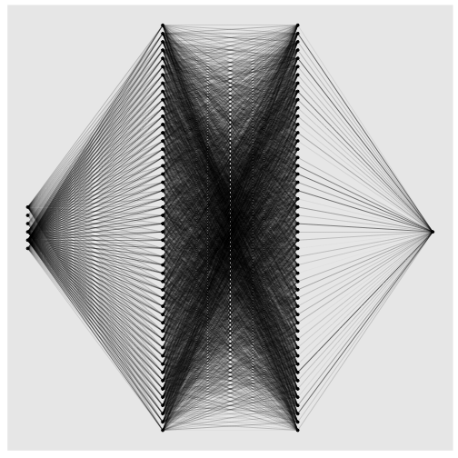

The neural network 5 input nodes (3 continuoues features, Sepal.Width, Petal.Length, Petal.Width and the contrasts for the Species variable (n_classes - 1)) and 1 output node for the response (Sepal.Length).

### Baseline loss

At the start of the training we calculate a baseline loss for an an intercept only model. It allows us to control the training because the goal is to beat the baseline loss. If we don't, we need to adjust the optimization parameters (epochs and lr (learning rate)):

``` r
nn.fit <- dnn(Sepal.Length~. , data = data, epochs = 50, lr = 0.6, loss = "mse", verbose = FALSE) # lr too high
```

vs

``` r
nn.fit <- dnn(Sepal.Length~. , data = data, epochs = 50, lr = 0.01, loss = "mse", verbose = FALSE)
```

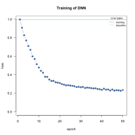

See `vignette("B-Training_neural_networks"`) for more details on how to adjust the optimization procedure and increase the probability of convergence.

### Adding a validation set to the training process

In order to see where your model might suffer from overfitting the addition of a validation set can be useful. With `dnn()` you can put `validation = 0.x` and define a percentage that will not be used for training and only for validation after each epoch. During training, a loss plot will show you how the two losses behave (see `vignette("B-Training_neural_networks"`) for details on training NN and guaranteeing their convergence).

``` r
#20% of data set is used as validation set
nn.fit <- dnn(Sepal.Length~., data = data, epochs = 32,
              loss= "mse", validation = 0.2)
```

Weights oft the last and the epoch with the lowest validation loss are saved:

``` r
length(nn.fit$weights)
#> [1] 2
```

The default is to use the weights of the last epoch. But we can also tell the model to use the weights with the lowest validation loss:

``` r
nn.fit$use_model_epoch = 1 # Default, use last epoch
nn.fit$use_model_epoch = 2 # Use weights from epoch with lowest validation loss
```

### Methods

cito supports many of the well-known methods from other statistical packages:

``` r
predict(nn.fit)
coef(nn.fit)
print(nn.fit)
```

## Explainable AI - Understanding your model

xAI can produce outputs that are similar to known outputs from statistical models:

| xAI Method                                                                       | Explanation                                                                                                                                                                                      | Statistical equivalent    |
|----------------------------------------------------------------------------------|--------------------------------------------------------------------------------------------------------------------------------------------------------------------------------------------------|---------------------------|
| Feature importance (returned by `summary(nn.fit)`)                               | Feature importance based on permutations. See [Fisher, Rudin, and Dominici (2018)](#0) Similar to how much variance in the data is explained by the features.                                    | `anova(model)`            |
| Average conditional effects (ACE) (returned by `summary(nn.fit)`)                | Average of local derivatives, approximation of linear effects. See [Scholbeck et al. (2022)](https://arxiv.org/abs/2201.08837) and [Pichler and Hartig (2023)](https://arxiv.org/abs/2306.10551) | `lm(Y~X)`                 |
| Standard Deviation of Conditional Effects (SDCE) (returned by `summary(nn.fit)`) | Standard deviation of the average conditional effects. Correlates with the non-linearity of the effects.                                                                                         |                           |
| Partial dependency plots (`PDP(nn.fit)`)                                         | Visualization of the response-effect curve.                                                                                                                                                      | `plot(allEffects(model))` |
| Accumulated local effect plots (`ALE(nn.fit)`)                                   | Visualization of the response-effect curve. More robust against collinearity compared to PDPs                                                                                                    | `plot(allEffects(model))` |

The `summary()` returns feature importance, ACE and SDCE:

``` r
# Calculate and return feature importance
summary(nn.fit)
#> Summary of Deep Neural Network Model
#> 
#> Feature Importance:
#>       variable importance_1
#> 1  Sepal.Width     2.266942
#> 2 Petal.Length    19.364085
#> 3  Petal.Width     1.816410
#> 4      Species     1.101089
#> 
#> Average Conditional Effects:
#>              Response_1
#> Sepal.Width   0.3135183
#> Petal.Length  1.1674297
#> Petal.Width  -0.3144642
#> 
#> Standard Deviation of Conditional Effects:
#>              Response_1
#> Sepal.Width  0.05861976
#> Petal.Length 0.11233247
#> Petal.Width  0.05357466
```

``` r
#returns weights of neural network
coef(nn.fit)
```

### Uncertainties/p-Values

We can use bootstrapping to obtain uncertainties for the xAI metrics (and also for the predictions). For that we have to retrain our model with enabled bootstrapping:

``` r
df = data
df[,2:4] = scale(df[,2:4]) # scaling can help the NN to convergence faster
nn.fit <- dnn(Sepal.Length~., data = df,
              epochs = 100,
              verbose = FALSE,
              loss= "mse",
              bootstrap = 30L
              )
```

``` r
summary(nn.fit)
#> Summary of Deep Neural Network Model
#> 
#> ── Feature Importance
#>                 Importance Std.Err Z value Pr(>|z|)    
#> Sepal.Width →         1.58    0.44    3.59  0.00033 ***
#> Petal.Length →       39.56    9.40    4.21  2.6e-05 ***
#> Petal.Width →         1.62    1.37    1.19  0.23477    
#> Species →             2.02    1.66    1.22  0.22359    
#> ---
#> Signif. codes:  0 '***' 0.001 '**' 0.01 '*' 0.05 '.' 0.1 ' ' 1
#> 
#> ── Average Conditional Effects
#>                     ACE Std.Err Z value Pr(>|z|)    
#> Sepal.Width →    0.2834  0.0494    5.73  9.8e-09 ***
#> Petal.Length →   1.5751  0.1557   10.11  < 2e-16 ***
#> Petal.Width →   -0.2994  0.1557   -1.92    0.054 .  
#> ---
#> Signif. codes:  0 '***' 0.001 '**' 0.01 '*' 0.05 '.' 0.1 ' ' 1
#> 
#> ── Standard Deviation of Conditional Effects
#>                    ACE Std.Err Z value Pr(>|z|)    
#> Sepal.Width →   0.1105  0.0250    4.42  9.9e-06 ***
#> Petal.Length →  0.2062  0.0383    5.38  7.3e-08 ***
#> Petal.Width →   0.0743  0.0209    3.55  0.00039 ***
#> ---
#> Signif. codes:  0 '***' 0.001 '**' 0.01 '*' 0.05 '.' 0.1 ' ' 1
```

We find that Petal.Length and Sepal.Width are significant (categorical features are not supported yet for average conditional effects).

Let's compare the output to statistical outputs:

``` r
anova(lm(Sepal.Length~., data = df))
#> Analysis of Variance Table
#> 
#> Response: Sepal.Length
#>               Df  Sum Sq Mean Sq  F value    Pr(>F)    
#> Sepal.Width    1   2.060   2.060  15.0011 0.0001625 ***
#> Petal.Length   1 123.127 123.127 896.8059 < 2.2e-16 ***
#> Petal.Width    1   2.747   2.747  20.0055 1.556e-05 ***
#> Species        2   1.296   0.648   4.7212 0.0103288 *  
#> Residuals    144  19.770   0.137                       
#> ---
#> Signif. codes:  0 '***' 0.001 '**' 0.01 '*' 0.05 '.' 0.1 ' ' 1
```

Feature importance and the anova report Petal.Length as the most important feature.

Visualization of the effects:

``` r
PDP(nn.fit)
```

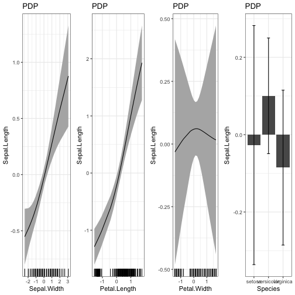

``` r
library(effects)
plot(allEffects(lm(Sepal.Length~., data = df)))
```

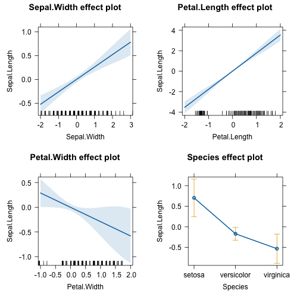

There are some differences between the statistical model and the NN - which is to be expected because the NN can fit the data more flexible. But at the same time the differences have large confidence intervals (e.g. the effect of Petal.Width)

## Architecture

The architecture in NN usually refers to the width and depth of the hidden layers (the layers between the input and the output layer) and their activation functions. You can increase the complexity of the NN by adding layers and/or making them wider:

``` r
# "simple NN" - low complexity
nn.fit <- dnn(Sepal.Length~., data = data, epochs = 100,
              loss= "mse", validation = 0.2,
              hidden = c(5L), verbose=FALSE)
```

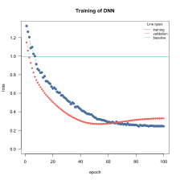

``` r

# "large NN" - high complexity
nn.fit <- dnn(Sepal.Length~., data = data, epochs = 100,
              loss= "mse", validation = 0.2,
              hidden = c(100L, 100), verbose=FALSE)
```

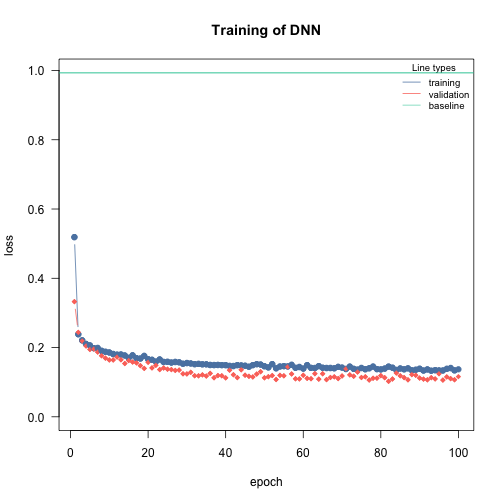

There is no definitive guide to choosing the right architecture for the right task. However, there are some general rules/recommendations: In general, wider, and deeper neural networks can improve generalization - but this is a double-edged sword because it also increases the risk of overfitting. So, if you increase the width and depth of the network, you should also add regularization (e.g., by increasing the lambda parameter, which corresponds to the regularization strength). Furthermore, in [Pichler & Hartig, 2023](https://arxiv.org/abs/2306.10551), we investigated the effects of the hyperparameters on the prediction performance as a function of the data size. For example, we found that the `selu` activation function outperforms `relu` for small data sizes (\<100 observations).

We recommend starting with moderate sizes (like the defaults), and if the model doesn't generalize/converge, try larger networks along with a regularization that helps to minimize the risk of overfitting (see `vignette("B-Training_neural_networks")` ).

#### Activation functions

By default, all layers are fitted with SeLU as activation function. $$
relu(x) = max (0,x)
$$You can also adjust the activation function of each layer individually to build exactly the network you want. In this case you have to provide a vector the same length as there are hidden layers. The activation function of the output layer is chosen with the loss argument and does not have to be provided.

``` r
#selu as activation function for all layers:
nn.fit <- dnn(Sepal.Length~., data = data, hidden = c(10,10,10,10), activation= "relu")
#layer specific activation functions:
nn.fit <- dnn(Sepal.Length~., data = data,
              hidden = c(10,10,10,10), activation= c("relu","selu","tanh","sigmoid"))
```

Note: The default activation function should be adequate for most tasks. We don't recommend tuning it.

## Tuning hyperparameters

### Regularization

#### Elastic net regularization

If elastic net is used, 'cito' will produce a sparse, generalized neural network. The L1/L2 loss can be controlled with the arguments alpha and lambda.

$$
 loss = \lambda * [ (1 - \alpha) * |weights| + \alpha |weights|^2 ]
$$

``` r
#elastic net penalty in all layers:
nn.fit <- dnn(Species~., data = data, alpha = 0.5, lambda = 0.01, verbose=FALSE, loss = "softmax")
```

#### Dropout Regularization

Dropout regularization as proposed in [Srivastava et al.](https://www.jmlr.org/papers/volume15/srivastava14a/srivastava14a.pdf?utm_content=buffer79b43&utm_medium=social&utm_source=twitter.com&utm_campaign=buffer,) can be controlled similar to elastic net regularization. In this approach, a percentage of different nodes gets left during each epoch.

``` r
#dropout of 35% on all layers:
nn.fit <- dnn(Species~., data = data, loss = "softmax", dropout = 0.35, verbose=FALSE)
```

### Learning rate

### Learning rate scheduler

Learning rate scheduler allow you to start with a high learning rate and decrease it during the training process. This leads to an overall faster training. You can choose between different types of schedulers. Namely, lambda, multiplicative, one_cycle and step.

The function config_lr_scheduler() helps you setup such a scheduler. See ?config_lr_scheduler() for more information

``` r
# Step Learning rate scheduler that reduces learning rate every 16 steps by a factor of 0.5
scheduler <- config_lr_scheduler(type = "step",
                                 step_size = 16,
                                 gamma = 0.5)

nn.fit <- dnn(Sepal.Length~., data = data,lr = 0.01, lr_scheduler= scheduler, verbose = FALSE)
```

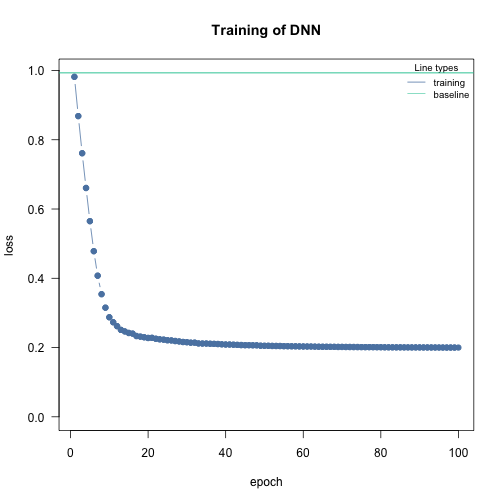

### Optimizer

Optimizer are responsible for fitting the neural network. The optimizer tries to minimize the loss function. As default the stochastic gradient descent is used. Custom optimizers can be used with `config_optimizer()`.\
See `?config_optimizer()` for more information.

``` r

# adam optimizer with learning rate 0.002, betas to 0.95, 0.999 and eps to 1.5e-08
opt <- config_optimizer(
  type = "sgd")

nn.fit <- dnn(Species~., data = data,  optimizer = opt, lr=0.002, verbose=FALSE, loss = "softmax")
```

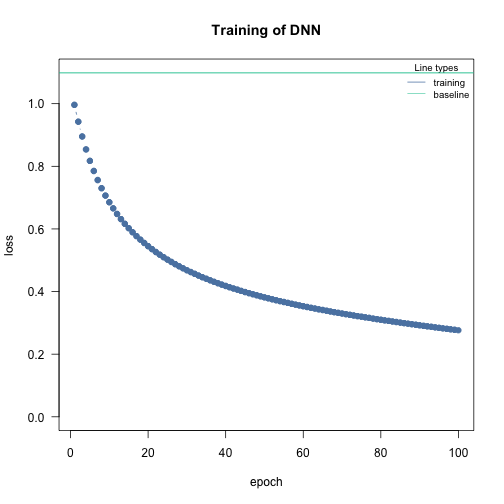

### Early Stopping

Adding early stopping criteria helps you save time by stopping the training process early, if the validation loss of the current epoch is bigger than the validation loss n epochs early. The n can be defined by the early_stopping argument. It is required to set validation \> 0.

``` r
# Stops training if validation loss at current epoch is bigger than that 15 epochs earlier
nn.fit <- dnn(Sepal.Length~., data = data, epochs = 1000,
              validation = 0.2, early_stopping = 15, verbose=FALSE)
```

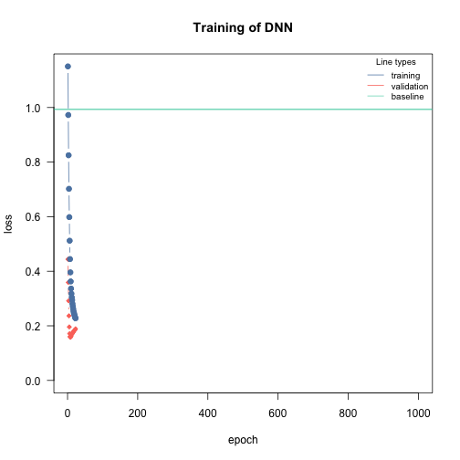

## Automatic hyperparameter tuning (experimental)

We started to support automatic hyperparameter tuning under Cross Validation. The tuning strategy is random search, i.e. potential hyperparameter values are sampled from uniform distributions, the boundaries can be specified by the user.

We can mark hyperparameters that should be tuned by cito by setting their values to `tune()`, for example `dnn (..., lr = tune()`. `tune()` is a function that creates a range of random values for the given hyperparameter. You can also change the maximum and minimum range of these values. The following table lists the hyperparameters that can currently be tuned:

| Hyperparameter | Example                                     | Details                                                                                                                                                                       |
|:---------------|:--------------------------------------------|:------------------------------------------------------------------------------------------------------------------------------------------------------------------------------|
| hidden         | `dnn(…,hidden=tune(10, 20, fixed=’depth’))` | Depth and width can be both tuned or only one of them, if both of them should be tuned, vectors for lower and upper \#' boundaries must be provided (first = number of nodes) |
| bias           | `dnn(…, bias=tune())`                       | Should the bias be turned on or off for all hidden layers                                                                                                                     |
| lambda         | `dnn(…, lambda = tune(0.0001, 0.1))`        | lambda will be tuned within the range (0.0001, 0.1)                                                                                                                           |
| alpha          | `dnn(…, lambda = tune(0.2, 0.4))`           | alpha will be tuned within the range (0.2, 0.4)                                                                                                                               |
| activation     | `dnn(…, activation = tune())`               | activation functions of the hidden layers will be tuned                                                                                                                       |
| dropout        | `dnn(…, dropout = tune())`                  | Dropout rate will be tuned (globally for all layers)                                                                                                                          |
| lr             | `dnn(…, lr = tune())`                       | Learning rate will be tuned                                                                                                                                                   |
| batchsize      | `dnn(…, batchsize = tune())`                | batch size will be tuned                                                                                                                                                      |
| epochs         | `dnn(…, batchsize = tune())`                | batchsize will be tuned                                                                                                                                                       |

The hyperparameters are tuned by random search (i.e., random values for the hyperparameters within a specified range) and by cross-validation. The exact tuning regime can be specified with [config_tuning].

Note that hyperparameter tuning can be expensive. We have implemented an option to parallelize hyperparameter tuning, including parallelization over one or more GPUs (the hyperparameter evaluation is parallelized, not the CV). This can be especially useful for small models. For example, if you have 4 GPUs, 20 CPU cores, and 20 steps (random samples from the random search), you could run `dnn(..., device="cuda",lr = tune(), batchsize=tune(), tuning=config_tuning(parallel=20, NGPU=4)`, which will distribute 20 model fits across 4 GPUs, so that each GPU will process 5 models (in parallel).

Tune learning rate as it is one of the most important hyperparameters:

``` r
nn.fit_tuned = dnn(Species~.,
                   data = iris,
                   lr = tune(0.0001, 0.1),
                   loss = "softmax",
                   tuning = config_tuning(steps = 3L, CV = 3L))
#> Starting hyperparameter tuning...
#> Fitting final model...
```

After tuning, the final model is trained with the best set of hyperparameters and returned.

## Continue training process

You can continue the training process of an existing model with continue_training().

``` r
# simple example, simply adding another 12 epochs to the training process
nn.fit <- continue_training(nn.fit, epochs = 12, verbose=FALSE)
head(predict(nn.fit))
#>            [,1]
#> [1,] -1.0259458
#> [2,] -1.4077228
#> [3,] -1.3449415
#> [4,] -1.2816025
#> [5,] -0.9411238
#> [6,] -0.5879976
```

It also allows you to change any training parameters, for example the learning rate. You can analyze the training process with analyze_training().

``` r

# picking the model with the smalles validation loss
# with changed parameters, in this case a smaller learning rate and a smaller batchsize
nn.fit <- continue_training(nn.fit,
                            epochs = 32,
                            changed_params = list(lr = 0.001, batchsize = 16),
                            verbose = FALSE)
```

## The best of both worlds - combining statistical models and deep learning

In addition to common loss functions, we also provide the option of using actual likelihoods - that is, we assume that the DNN approximates the underlying data generating model. An important consequence of this - also to ensure that the effects extracted by xAI are correct - is to check for model assumptions, such as whether the residuals are distributed as we would expect given our likelihood/probability distribution.

Example: Simulate from a negative binomial distribution and fit with a poisson-DNN

``` r
X = matrix(runif(500*3,-1,1), 500, 3)
Y = rnbinom(500, mu = exp(2.5*X[,1]), size = 0.3)
```

Fit model with a poisson likelihood:

``` r
df = data.frame(Y = Y, X)
m1 = dnn(Y~., data = df, loss = "poisson", lr = 0.005, epochs = 300L, verbose = FALSE)
```

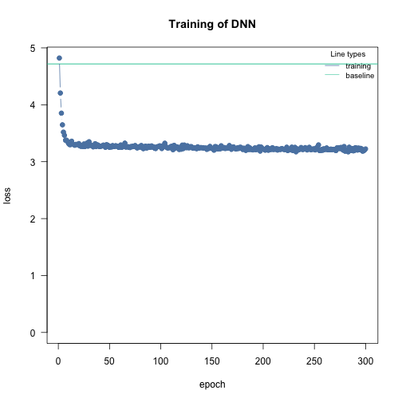

We can use the DHARMa package to check the residuals. DHARMa does not support cito directly, but we can use a general interface for residual checks. But first we need to simulate from our model:

``` r
library(DHARMa)
pred = predict(m1, type = "response")
sims = sapply(1:100, function(i) rpois(length(pred), pred))

res = createDHARMa(sims, Y, pred[,1], integerResponse = TRUE)
plot(res)
```

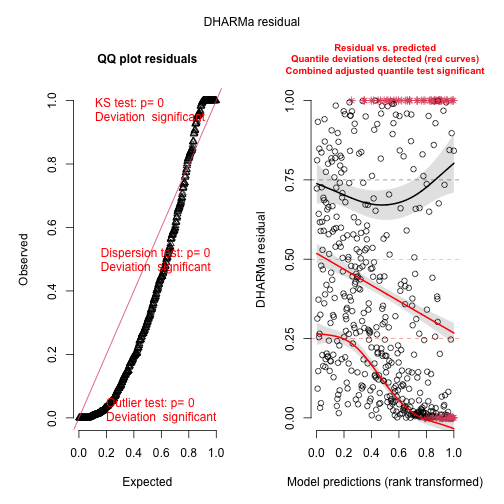

``` r
testOverdispersion(res)
#> testOverdispersion is deprecated, switch your code to using the testDispersion function
```

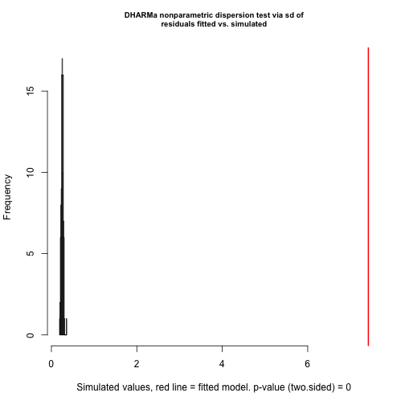

```         
#> 
#>  DHARMa nonparametric dispersion test via sd of residuals fitted vs. simulated
#> 
#> data:  simulationOutput
#> dispersion = 15.45, p-value < 2.2e-16
#> alternative hypothesis: two.sided
```

Overdispersion (biased effect estimates and inflated error rates could be a consequence of overdispersion) ! One solution (the only one implemented in cito) is to switch to negative binomial distribution that fits a variable dispersion parameter:

``` r
m2 = dnn(Y~., data = df, loss = "nbinom", lr = 0.005, epochs = 300L, verbose = FALSE, lambda = 0.0, alpha = 1.0)
```

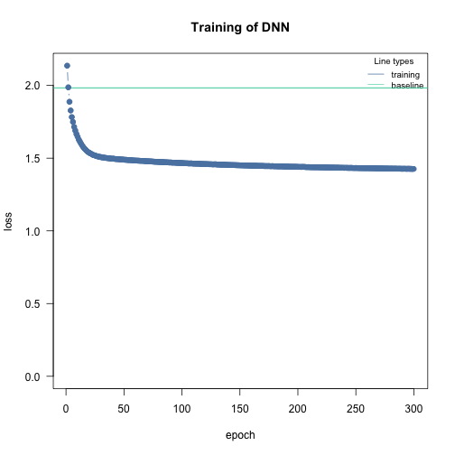

``` r
# Dispersion parameter:
m2$loss$parameter_link()
#> [1] 0.5323167
```

We have a custom implementation of the negative binomial distribution (which is similar to the "nbinom1" of glmmTMB (the nbinom converges to a poisson as the dispersion parameters approaches infinity)) which is why we provide a simulate function:

``` r
pred = predict(m2, type = "response")
sims = sapply(1:100, function(i) m2$loss$simulate(pred))

res = createDHARMa(sims, Y, pred[,1], integerResponse = TRUE)
plot(res, rank = FALSE)
```

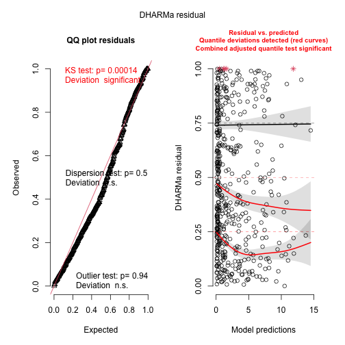

``` r
testOverdispersion(res)
#> testOverdispersion is deprecated, switch your code to using the testDispersion function
```

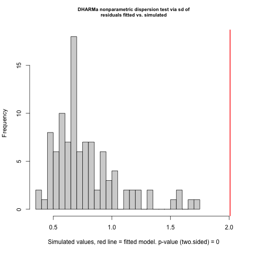

```         
#> 
#>  DHARMa nonparametric dispersion test via sd of residuals fitted vs. simulated
#> 
#> data:  simulationOutput
#> dispersion = 1.1972, p-value = 0.5
#> alternative hypothesis: two.sided
```

Better! But still not perfect, a challenge with maximum likelihood estimation and the negative binomial distribution is to get the theta estimate (disperson parameter) unbiased. The remaining pattern can probably be explained by the fact that the overdispersion was not perfectly estimated.

However, it is still better than the Poisson distribution, so what do we get by switching to a negative binomial? The p-values of the xAI metrics may not be strongly as affected as in a statistical model because we are not estimating the standard errors (and thus the p-values) from the MLE surface. The bootstrap is independent of the likelihood. However, the negative binomial distribution better weights overdispersed values, so we can expect our model to make more accurate predictions.
