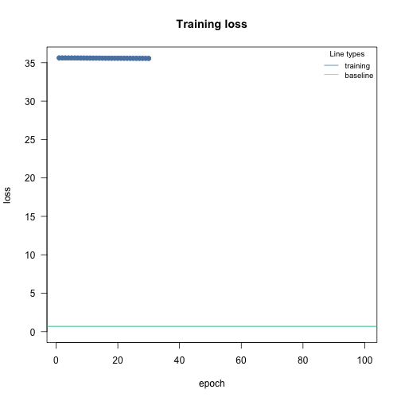
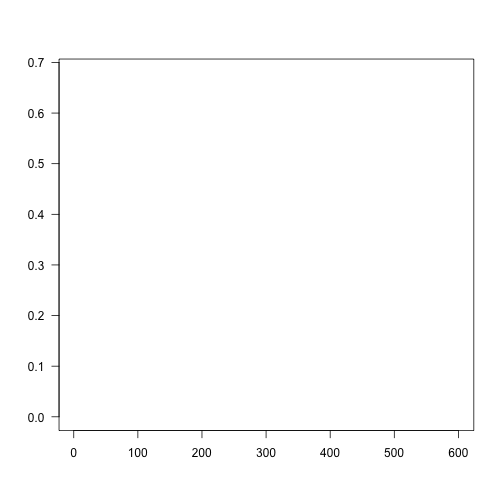
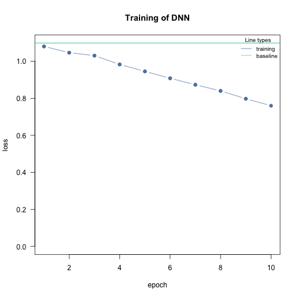
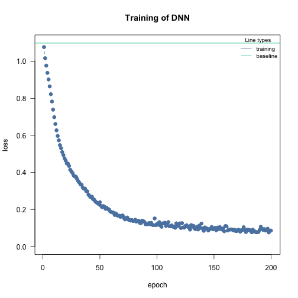
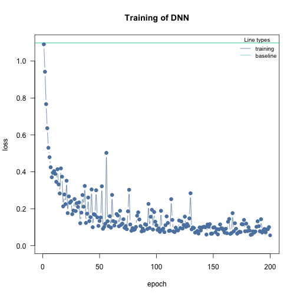
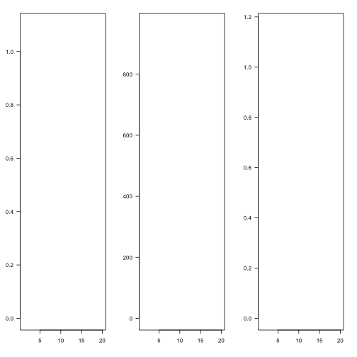
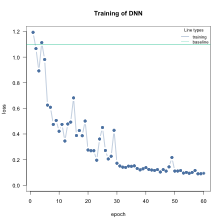
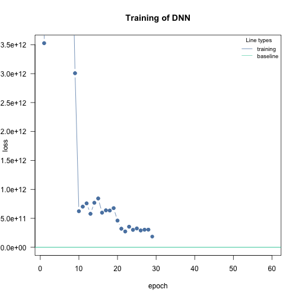
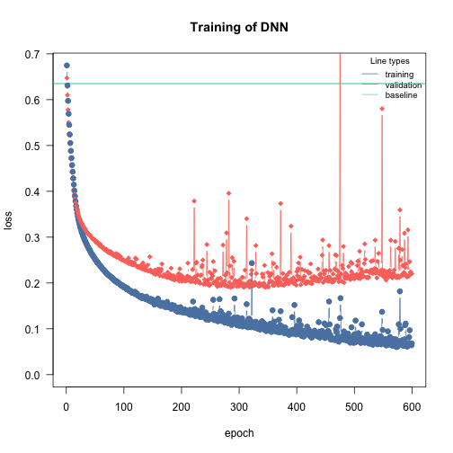
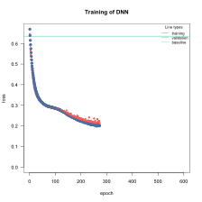

## Possible issues

-   Convergence issues, (often because of the learning rate), **training loss above baseline loss**:

    
    ```
    #> Error in cito:::visualize.training(m$losses, epoch = 100, new = TRUE, : argument "main" is missing, with no default
    ```
    
    

    If it looks like that, go to the [adjusting the learning rate section](#lr)

-   Overfitting, difference between training and testing/holdout/new data error is too high, or validation loss starts to increase again at some point during the training

    
    ```
    #> Error in cito:::visualize.training(m$losses, epoch = 600L, new = TRUE, : argument "main" is missing, with no default
    ```
    
    

    if it loos like that, go to the [overfitting section](#overfitting)

## Convergence issues {#lr}

Ensuring convergence can be tricky when training neural networks. Their training is sensitive to a combination of the learning rate (how much the weights are updated in each optimization step), the batch size (a random subset of the data is used in each optimization step), and the number of epochs (number of optimization steps).

### Epochs

Give the neural network enough time to learn. The epochs should be high enough so that the training loss "stabilizes":


```r
m = dnn(Species~., data = iris, epochs = 10L, loss = "softmax", verbose=FALSE)
```



After 10 epochs the loss was still decreasing, let's run the model for more epochs:


```r
m = dnn(Species~., data = iris, epochs = 200L, loss = "softmax", verbose=FALSE)
```



It takes around 190-200 epochs until the loss doesn't decrease anymore. The "speed" of the learning depends also on the learning rate. Higher rates means larger steps into direction of the minima of the loss function:


```r
m = dnn(Species~., data = iris, epochs = 200L, loss = "softmax", lr = 0.05, verbose=FALSE)
```



Now it only takes about 100 epochs, but we also see that the training loss becomes wobbly. Larger learning rates increase the probability that local minima are skipped and the optimizer has problems to hit a minima.

### Learning rate

Typically, the learning rate should be decreased with the size of the neural networks (depth of the network and width of the hidden layers). We provide a baseline loss (intercept only model) that can give hints about an appropriate learning rate.


```r
nn.fit_good<- dnn(Species~., data = datasets::iris, lr = 0.09, epochs = 20L, loss = "softmax", verbose = FALSE, plot = FALSE)
nn.fit_high<- dnn(Species~., data = datasets::iris, lr = 2.09, epochs = 20L, loss = "softmax", verbose = FALSE, plot = FALSE)
nn.fit_low<- dnn(Species~., data = datasets::iris, lr = 0.00000001, epochs = 20L, loss = "softmax", verbose = FALSE, plot = FALSE)

par(mfrow = c(1, 3), mar = c(4, 3, 2, 2))
cito:::visualize.training(nn.fit_good$losses, epoch = 20, new = TRUE, baseline = nn.fit_good$base_loss)
#> Error in cito:::visualize.training(nn.fit_good$losses, epoch = 20, new = TRUE, : argument "main" is missing, with no default
cito:::visualize.training(nn.fit_high$losses, epoch = 20, new = TRUE, baseline = nn.fit_good$base_loss)
#> Error in cito:::visualize.training(nn.fit_high$losses, epoch = 20, new = TRUE, : argument "main" is missing, with no default
cito:::visualize.training(nn.fit_low$losses, epoch = 20, new = TRUE, baseline = nn.fit_good$base_loss)
#> Error in cito:::visualize.training(nn.fit_low$losses, epoch = 20, new = TRUE, : argument "main" is missing, with no default
```



If the training loss of the model doesn't fall below the baseline loss, the learning rate is either too high or too low. If this happens, try higher and lower learning rates.

A common strategy is to try (manually) a few different learning rates to see if the learning rate is on the right scale.

### Solution: learning rate scheduler

A common strategy to deal with the learning rate problem is to start with a high learning rate, and if the loss does not decrease, the learning rate is reduced according to a specific plan.

I favor the "reduce learning rate on plateau" scheduler. If a loss plateau isn't resolved for a certain number of epochs (patience), the learning rate will be reduced ($lr_{new} = factor * lr_{old}$):


```r
nn.fit_high<- dnn(Species~., data = datasets::iris,
                  lr = 0.2,
                  epochs = 60L,
                  loss = "softmax",
                  lr_scheduler = config_lr_scheduler("reduce_on_plateau", patience = 5, factor = 0.5),
                  verbose = TRUE,
                  plot = TRUE)
#> Loss at epoch 1: 1.021834, lr: 0.20000
```



```
#> Loss at epoch 2: 0.784247, lr: 0.20000
#> Loss at epoch 3: 0.523949, lr: 0.20000
#> Loss at epoch 4: 0.513148, lr: 0.20000
#> Loss at epoch 5: 0.511179, lr: 0.20000
#> Loss at epoch 6: 0.419983, lr: 0.20000
#> Loss at epoch 7: 0.398057, lr: 0.20000
#> Loss at epoch 8: 0.479610, lr: 0.20000
#> Loss at epoch 9: 0.414423, lr: 0.20000
#> Loss at epoch 10: 0.430415, lr: 0.20000
#> Loss at epoch 11: 0.324195, lr: 0.20000
#> Loss at epoch 12: 0.481322, lr: 0.20000
#> Loss at epoch 13: 0.352256, lr: 0.20000
#> Loss at epoch 14: 0.580036, lr: 0.20000
#> Loss at epoch 15: 0.296640, lr: 0.20000
#> Loss at epoch 16: 0.457924, lr: 0.20000
#> Loss at epoch 17: 0.535021, lr: 0.20000
#> Loss at epoch 18: 0.330827, lr: 0.20000
#> Loss at epoch 19: 0.288825, lr: 0.20000
#> Loss at epoch 20: 0.388286, lr: 0.20000
#> Loss at epoch 21: 0.413969, lr: 0.20000
#> Loss at epoch 22: 0.315708, lr: 0.20000
#> Loss at epoch 23: 0.421718, lr: 0.20000
#> Loss at epoch 24: 0.294159, lr: 0.20000
#> Loss at epoch 25: 0.368195, lr: 0.10000
#> Loss at epoch 26: 0.126924, lr: 0.10000
#> Loss at epoch 27: 0.233660, lr: 0.10000
#> Loss at epoch 28: 0.206882, lr: 0.10000
#> Loss at epoch 29: 0.147535, lr: 0.10000
#> Loss at epoch 30: 0.121023, lr: 0.10000
#> Loss at epoch 31: 0.141637, lr: 0.10000
#> Loss at epoch 32: 0.280258, lr: 0.10000
#> Loss at epoch 33: 0.113553, lr: 0.10000
#> Loss at epoch 34: 0.182583, lr: 0.10000
#> Loss at epoch 35: 0.162140, lr: 0.10000
#> Loss at epoch 36: 0.110794, lr: 0.10000
#> Loss at epoch 37: 0.266870, lr: 0.10000
#> Loss at epoch 38: 0.118162, lr: 0.10000
#> Loss at epoch 39: 0.120619, lr: 0.10000
#> Loss at epoch 40: 0.118278, lr: 0.10000
#> Loss at epoch 41: 0.110401, lr: 0.10000
#> Loss at epoch 42: 0.292702, lr: 0.10000
#> Loss at epoch 43: 0.113928, lr: 0.10000
#> Loss at epoch 44: 0.115036, lr: 0.10000
#> Loss at epoch 45: 0.154610, lr: 0.10000
#> Loss at epoch 46: 0.172704, lr: 0.10000
#> Loss at epoch 47: 0.200501, lr: 0.05000
#> Loss at epoch 48: 0.086275, lr: 0.05000
#> Loss at epoch 49: 0.083288, lr: 0.05000
#> Loss at epoch 50: 0.081173, lr: 0.05000
#> Loss at epoch 51: 0.079097, lr: 0.05000
#> Loss at epoch 52: 0.074330, lr: 0.05000
#> Loss at epoch 53: 0.090034, lr: 0.05000
#> Loss at epoch 54: 0.087791, lr: 0.05000
#> Loss at epoch 55: 0.094438, lr: 0.05000
#> Loss at epoch 56: 0.092987, lr: 0.05000
#> Loss at epoch 57: 0.070762, lr: 0.05000
#> Loss at epoch 58: 0.073787, lr: 0.05000
#> Loss at epoch 59: 0.140457, lr: 0.05000
#> Loss at epoch 60: 0.069994, lr: 0.05000
```

At the end of the training, the learning rate is 0.025

Note: The learning rate scheduler is a powerful approach to improve the likeliness of convergence, BUT it cannot help with much too high learning rates!


```r
nn.fit_high<- dnn(Species~., data = datasets::iris,
                  lr = 2,
                  epochs = 60L,
                  loss = "softmax",
                  lr_scheduler = config_lr_scheduler("reduce_on_plateau", patience = 5, factor = 0.5),
                  verbose = TRUE,
                  plot = TRUE)
#> Loss at epoch 1: 3526205624246.549316, lr: 2.00000
```



```
#> Loss at epoch 2: 48831025028505.601562, lr: 2.00000
#> Loss at epoch 3: 41852271905996.796875, lr: 2.00000
#> Loss at epoch 4: 32994145232486.398438, lr: 2.00000
#> Loss at epoch 5: 25454932970700.800781, lr: 2.00000
#> Loss at epoch 6: 18362799069593.601562, lr: 2.00000
#> Loss at epoch 7: 11672021368832.000000, lr: 1.00000
#> Loss at epoch 8: 6166342873907.200195, lr: 1.00000
#> Loss at epoch 9: 3007619963289.600098, lr: 1.00000
#> Loss at epoch 10: 622980843929.599976, lr: 1.00000
#> Loss at epoch 11: 702466821324.800049, lr: 1.00000
#> Loss at epoch 12: 758849321369.599976, lr: 1.00000
#> Loss at epoch 13: 578470640025.599976, lr: 1.00000
#> Loss at epoch 14: 769169827430.400024, lr: 1.00000
#> Loss at epoch 15: 843194091929.599976, lr: 1.00000
#> Loss at epoch 16: 598178904473.599976, lr: 1.00000
#> Loss at epoch 17: 638339955916.800049, lr: 1.00000
#> Loss at epoch 18: 634724427366.400024, lr: 1.00000
#> Loss at epoch 19: 675600521625.599976, lr: 0.50000
#> Loss at epoch 20: 461313003520.000000, lr: 0.50000
#> Loss at epoch 21: 320872775680.000000, lr: 0.50000
#> Loss at epoch 22: 273174328115.200012, lr: 0.50000
#> Loss at epoch 23: 355574171238.400024, lr: 0.50000
#> Loss at epoch 24: 300888318771.200012, lr: 0.50000
#> Loss at epoch 25: 325603269017.599976, lr: 0.50000
#> Loss at epoch 26: 290695089356.799988, lr: 0.50000
#> Loss at epoch 27: 303663080243.200012, lr: 0.50000
#> Loss at epoch 28: 304653051494.400024, lr: 0.25000
#> Loss at epoch 29: 184628136601.600006, lr: 0.25000
#> Cancel training because loss is still above baseline, please hyperparameters. See vignette('B-Training_neural_networks') for help.
```

Although the learning rate ended up being 0.01562, the loss never outperformed the baseline loss. The optimizer jumped right at the beginning into a completely unrealistic solution space for the parameters of the NN, from which we could not recover.

## Overfitting {#overfitting}

Overfitting means that the model fits the training data well, but generalizes poorly to new observations. We can use the validation argument to detect overfitting. If the validation loss starts to increase again at a certain point, it often means that the models are starting to overfit your training data:


```r
library(EcoData) # can be install from github using devtools::install_github(repo = "TheoreticalEcology/EcoData", dependencies = FALSE, build_vignettes = FALSE)
df = elephant$occurenceData
m = dnn(Presence~., data = df, lr = 0.03, epochs = 600L, loss = "binomial", validation = 0.2,  hidden = c(350L, 350L, 350L), activation = "relu", batchsize = 150L, verbose = FALSE, plot = TRUE)
```



**Solutions**:

-   Re-train with epochs = point where model started to overfit

-   Early stopping, stop training when model starts to overfit, can be specified using the `⁠early_stopping=…⁠` argument

-   Use regularization (dropout or elastic-net, see next section)

### Early stopping and regularization

Early stopping = stop training when validation loss cannot be improved for x epochs (if there is no validation split, the training loss is used).

lambda = 0.001 is the regularization strength and alpha = 0.2 means that 20% L1 and 80% L2 weighting.


```r
m = dnn(Presence~., data = df, lr = 0.03, epochs = 600L, loss = "binomial", validation = 0.2,  hidden = c(350L, 350L, 350L), activation = "relu", batchsize = 150L, verbose = FALSE, plot = TRUE, early_stopping = 10, lambda = 0.001, alpha = 0.2)
```



The training is aborted!
