## Species distribution model - African elephant

The goal is to build a SDM for the African elephant. A pre-processed dataset from [Angelov, 2020](https://zenodo.org/record/4048271) can be found in the EcoData package which is only available on github:


```r
if(!require(EcoData)) devtools::install_github(repo = "TheoreticalEcology/EcoData",
                         dependencies = FALSE, build_vignettes = FALSE)

library(EcoData)
df = EcoData::elephant$occurenceData
head(df)
#>       Presence       bio1       bio2       bio3       bio4        bio5
#> 3364         0 -0.4981747 -0.2738045  0.5368968 -0.5409999 -0.36843571
#> 6268         0  0.6085908 -0.5568352  1.0340686 -1.2492050 -0.11835651
#> 10285        0 -0.7973005  1.4648130 -1.0540532  2.0759423  0.07614953
#> 2247         0  0.6385034  1.3435141 -0.1591439 -0.5107148  1.10425291
#> 9821         0  0.6684160 -0.6781341  0.6363311 -0.9906170  0.15950927
#> 1351         0  0.9675418 -0.6781341 -0.3580126 -0.3748202  0.77081398
#>             bio6       bio7       bio8       bio9       bio10       bio11
#> 3364   0.2947850 -0.5260099 -1.2253960  0.2494100 -0.64527314 -0.06267842
#> 6268   0.8221087 -0.8938475  0.4233787  0.7746249  0.09168503  0.94419518
#> 10285 -1.5860029  1.6284678  0.2768209 -1.5153122 -0.03648161 -1.44165748
#> 2247  -0.1622288  0.8577603  0.4600181  0.5855475  0.54026827  0.68153250
#> 9821   0.9099960 -0.8062671  0.3867393  0.8586593  0.31597665  0.94419518
#> 1351   0.8748411 -0.3858812  0.3134604  1.0477367  0.98885151  0.94419518
#>            bio12      bio13       bio14        bio15      bio16      bio17
#> 3364   0.6285371  0.6807958 -0.29703736 -0.008455252  0.7124535 -0.2949994
#> 6268   1.1121516  0.5918442  0.01619202 -0.884507980  0.5607328  0.3506918
#> 10285 -1.2351482 -1.3396742 -0.50585695  0.201797403 -1.3499999 -0.5616980
#> 2247   0.5951165  0.8714061 -0.55806185  0.236839512  1.1012378 -0.5616980
#> 9821   1.1003561  0.5537222  0.59044589 -1.024676416  0.6413344  0.7437213
#> 1351   0.7287986  1.1255533 -0.50585695  0.236839512  1.2956300 -0.4494038
#>             bio18       bio19
#> 3364  -1.06812752  1.96201807
#> 6268   1.22589281 -0.36205814
#> 10285 -0.42763181 -0.62895735
#> 2247  -0.20541902 -0.58378979
#> 9821   0.06254347 -0.05409751
#> 1351  -0.90473576  2.47939193
```

Presence is our response variable and we have the 19 bioclim variables as features/predictors.

Let's split part of the data away so that we can use it at the end to evaluate our model:


```r
indices = sample.int(nrow(df), 300)
test = df[indices,]
df = df[-indices,]
```

### Adjusting optimization parameters - Convergence

We will first try a simple DNN with default values and the binomial likelihood. We use 30% of the data as validation holdout to check for overfitting:


```r
library(cito)
model = dnn(Presence~., data = df,
            batchsize = 100L,
            validation = 0.3, loss = "binomial",
            verbose = FALSE)
```

<div class="figure" style="text-align: center">
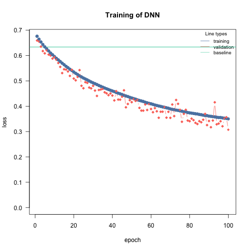
<p class="caption">plot of chunk unnamed-chunk-4</p>
</div>

We see that the training and test losses were still decreasing which means we didn't train the model long enough. We could now either increase the number of epochs or increase the learning rate so that the model trains faster:


```r
model = dnn(Presence~., data = df,
            batchsize = 100L,
            lr = 0.05,
            validation = 0.3, loss = "binomial",
            verbose = FALSE)
```

<div class="figure" style="text-align: center">
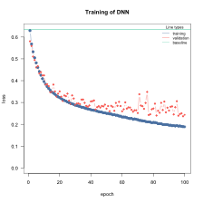
<p class="caption">plot of chunk unnamed-chunk-5</p>
</div>

Much better! But still now enough epochs. Also, let's see if we can further decrease the loss by using a wider and deeper neural network:


```r
model = dnn(Presence~., data = df,
            batchsize = 100L,
            hidden = c(100L, 100L, 100L),
            lr = 0.05,
            validation = 0.3, loss = "binomial",
            verbose = FALSE)
```

<div class="figure" style="text-align: center">
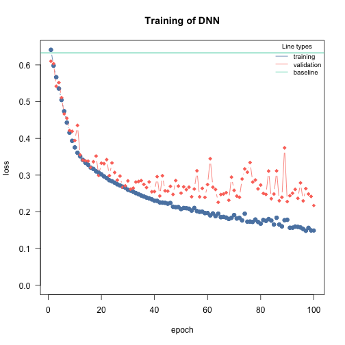
<p class="caption">plot of chunk unnamed-chunk-6</p>
</div>

At the end of the training, the losses start to get jumpy, which can be a sign of potential overfitting. We can control that by adding a weak regularization (but we only want a L2 regularization, so we set alpha to 1.0):


```r
model = dnn(Presence~., data = df,
            batchsize = 100L,
            epochs = 150L,
            hidden = c(100L, 100L, 100L),
            lr = 0.05,
            lambda = 0.001,
            alpha = 1.0,
            validation = 0.3, loss = "binomial",
            verbose = FALSE)
```

<div class="figure" style="text-align: center">
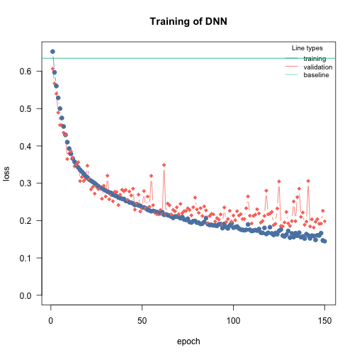
<p class="caption">plot of chunk unnamed-chunk-7</p>
</div>

We will turn on now advanced features that help with the convergence and to reduce overfitting:

-   learning rate scheduler - reduces learning rate during training

-   early stopping - stop training when validation loss starts to increase


```r
model = dnn(Presence~., data = df,
            batchsize = 100L,
            epochs = 150L,
            hidden = c(100L, 100L, 100L),
            lr = 0.05,
            lambda = 0.001,
            alpha = 1.0,
            validation = 0.3, loss = "binomial",
            verbose = FALSE,
            lr_scheduler = config_lr_scheduler("reduce_on_plateau", patience = 7), # reduce learning rate each 7 epochs if the validation loss didn't decrease,
            early_stopping = 14 # stop training when validation loss didn't decrease for 10 epochs
            )
```

<div class="figure" style="text-align: center">

<p class="caption">plot of chunk unnamed-chunk-8</p>
</div>

Great! We found now a model architecture and training procedure that fits and trains well. Let's proceed to our final model

### Train final model with bootstrapping to obtain uncertainties

We haven't directly started with bootstrapping because it complicates the adjustment of the training procedure.

Uncertainties can be obtained by using bootstrapping. Be aware that this can be computational expensive:


```r
model_boot = dnn(Presence~., data = df,
                 batchsize = 100L,
                 epochs = 150L,
                 hidden = c(100L, 100L, 100L),
                 lr = 0.05,
                 lambda = 0.001,
                 alpha = 1.0,
                 validation = 0.3, loss = "binomial",
                 verbose = FALSE,
                 lr_scheduler = config_lr_scheduler("reduce_on_plateau", patience = 7), # reduce learning rate each 7 epochs if the validation loss didn't decrease,
                 early_stopping = 14, # stop training when validation loss didn't decrease for 10 epochs
                 bootstrap = 20L,
                 bootstrap_parallel = 5L
            )
```

### Predictions

We can use the model now for predictions:


```r
predictions = predict(model_boot, newdata = test)
dim(predictions)
#> [1]  20 300   1
```

The predictions are 2/3 dimensional because of the bootstrapping. Calculate the AUC interval:


```r
hist(sapply(1:20, function(i) Metrics::auc(test$Presence, predictions[i,,])),
     xlim = c(0, 1), main = "AUC of ensemble model", xlab = "AUC")
```

<div class="figure" style="text-align: center">
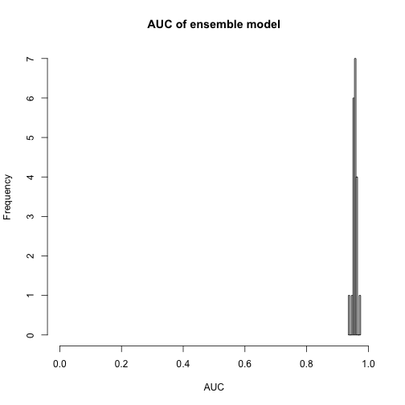
<p class="caption">plot of chunk unnamed-chunk-11</p>
</div>

We can now predict the habitat suitability of the elephant (Note that spatial dependencies are required):


```r
library(raster)
#> Loading required package: sp
#> The legacy packages maptools, rgdal, and rgeos, underpinning the sp package,
#> which was just loaded, will retire in October 2023.
#> Please refer to R-spatial evolution reports for details, especially
#> https://r-spatial.org/r/2023/05/15/evolution4.html.
#> It may be desirable to make the sf package available;
#> package maintainers should consider adding sf to Suggests:.
#> The sp package is now running under evolution status 2
#>      (status 2 uses the sf package in place of rgdal)
library(sp)
library(rsample)
library(latticeExtra)
#> Loading required package: lattice
#> 
#> Attaching package: 'lattice'
#> The following object is masked from 'package:EcoData':
#> 
#>     melanoma
library(sp)
library(ggplot2)
#> 
#> Attaching package: 'ggplot2'
#> The following object is masked from 'package:latticeExtra':
#> 
#>     layer
library(maptools)
#> Please note that 'maptools' will be retired during October 2023,
#> plan transition at your earliest convenience (see
#> https://r-spatial.org/r/2023/05/15/evolution4.html and earlier blogs
#> for guidance);some functionality will be moved to 'sp'.
#>  Checking rgeos availability: FALSE
customPredictFun = function(model, data) {
  return(apply(predict(model, data), 2:3, mean)[,1])
}

normalized_raster = EcoData::elephant$predictionData

predictions =
  raster::predict(normalized_raster,
                  model_boot,
                  fun = customPredictFun)

habitat_plot =
  spplot(predictions, colorkey = list(space = "left") )
habitat_plot
```

<div class="figure" style="text-align: center">
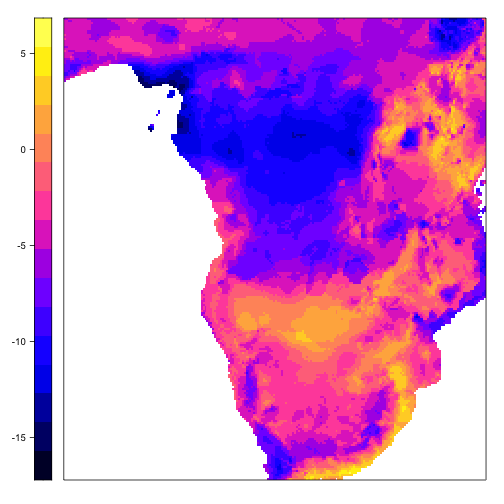
<p class="caption">plot of chunk unnamed-chunk-12</p>
</div>

Moreover, we can visualize the uncertainty of our model, instead of calculating the average occurrence probability, we calculate for each prediction the standard deviation and visualize it:


```r
customPredictFun_sd = function(model, data) {
  return(apply(predict(model, data), 2:3, sd)[,1])
}
predictions =
  raster::predict(normalized_raster,
                  model_boot,
                  fun = customPredictFun_sd)

uncertain_plot =
  spplot(predictions, colorkey = list(space = "left") )
uncertain_plot
```

<div class="figure" style="text-align: center">
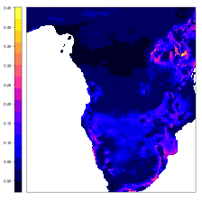
<p class="caption">plot of chunk unnamed-chunk-13</p>
</div>

### Inference

Neural networks are often called black-box models but the tools of explainable AI (xAI) allows us to understand them - and actually infer properties similar to what a linear regression model can provide (the calculation can take some time...):


```r
results = summary(model_boot)
results
#> Summary of Deep Neural Network Model
#> 
#> ── Feature Importance
#>                  Importance Std.Err Z value Pr(>|z|)    
#> bio1 → Presence     0.02530 0.00850    2.98  0.00291 ** 
#> bio2 → Presence     0.02722 0.01157    2.35  0.01866 *  
#> bio3 → Presence     0.02689 0.01249    2.15  0.03136 *  
#> bio4 → Presence     0.03214 0.01455    2.21  0.02722 *  
#> bio5 → Presence     0.02100 0.01381    1.52  0.12824    
#> bio6 → Presence     0.02427 0.01037    2.34  0.01924 *  
#> bio7 → Presence     0.01995 0.01046    1.91  0.05642 .  
#> bio8 → Presence     0.02497 0.00982    2.54  0.01102 *  
#> bio9 → Presence     0.04869 0.03090    1.58  0.11503    
#> bio10 → Presence    0.01805 0.00805    2.24  0.02487 *  
#> bio11 → Presence    0.02436 0.00781    3.12  0.00181 ** 
#> bio12 → Presence    0.02901 0.00807    3.60  0.00032 ***
#> bio13 → Presence    0.01742 0.01160    1.50  0.13311    
#> bio14 → Presence    0.02921 0.01279    2.28  0.02236 *  
#> bio15 → Presence    0.04018 0.01196    3.36  0.00078 ***
#> bio16 → Presence    0.06313 0.03240    1.95  0.05137 .  
#> bio17 → Presence    0.01699 0.00867    1.96  0.04996 *  
#> bio18 → Presence    0.03345 0.01384    2.42  0.01570 *  
#> bio19 → Presence    0.00882 0.00695    1.27  0.20437    
#> ---
#> Signif. codes:  0 '***' 0.001 '**' 0.01 '*' 0.05 '.' 0.1 ' ' 1
#> 
#> ── Average Conditional Effects
#>                      ACE Std.Err Z value Pr(>|z|)  
#> bio1 → Presence   0.2514  0.5640    0.45    0.656  
#> bio2 → Presence  -0.4704  0.2565   -1.83    0.067 .
#> bio3 → Presence  -0.4713  0.3628   -1.30    0.194  
#> bio4 → Presence   0.6032  0.5129    1.18    0.240  
#> bio5 → Presence   0.5851  0.6851    0.85    0.393  
#> bio6 → Presence   0.5052  0.4479    1.13    0.259  
#> bio7 → Presence  -0.2617  0.5095   -0.51    0.607  
#> bio8 → Presence  -0.0811  0.4857   -0.17    0.867  
#> bio9 → Presence  -1.2476  0.6434   -1.94    0.053 .
#> bio10 → Presence -0.0884  0.3857   -0.23    0.819  
#> bio11 → Presence -0.2403  0.4292   -0.56    0.576  
#> bio12 → Presence -0.9255  0.5171   -1.79    0.073 .
#> bio13 → Presence  0.4083  0.5382    0.76    0.448  
#> bio14 → Presence  1.0270  0.4229    2.43    0.015 *
#> bio15 → Presence -0.3658  0.2945   -1.24    0.214  
#> bio16 → Presence -1.6111  0.7566   -2.13    0.033 *
#> bio17 → Presence  0.5998  0.3611    1.66    0.097 .
#> bio18 → Presence -0.0806  0.3505   -0.23    0.818  
#> bio19 → Presence -0.4002  0.5061   -0.79    0.429  
#> ---
#> Signif. codes:  0 '***' 0.001 '**' 0.01 '*' 0.05 '.' 0.1 ' ' 1
#> 
#> ── Standard Deviation of Conditional Effects
#>                    ACE Std.Err Z value Pr(>|z|)    
#> bio1 → Presence  0.776   0.139    5.58  2.4e-08 ***
#> bio2 → Presence  0.692   0.275    2.51  0.01194 *  
#> bio3 → Presence  0.776   0.245    3.17  0.00153 ** 
#> bio4 → Presence  0.954   0.351    2.72  0.00651 ** 
#> bio5 → Presence  0.668   0.228    2.93  0.00341 ** 
#> bio6 → Presence  0.644   0.195    3.31  0.00093 ***
#> bio7 → Presence  0.633   0.228    2.77  0.00560 ** 
#> bio8 → Presence  1.025   0.294    3.49  0.00049 ***
#> bio9 → Presence  0.630   0.249    2.53  0.01129 *  
#> bio10 → Presence 0.626   0.198    3.16  0.00159 ** 
#> bio11 → Presence 0.779   0.222    3.51  0.00045 ***
#> bio12 → Presence 0.871   0.300    2.90  0.00371 ** 
#> bio13 → Presence 0.656   0.258    2.55  0.01091 *  
#> bio14 → Presence 0.891   0.298    3.00  0.00274 ** 
#> bio15 → Presence 0.808   0.225    3.60  0.00032 ***
#> bio16 → Presence 1.024   0.348    2.94  0.00324 ** 
#> bio17 → Presence 0.625   0.213    2.93  0.00335 ** 
#> bio18 → Presence 1.661   0.617    2.69  0.00707 ** 
#> bio19 → Presence 0.559   0.185    3.02  0.00256 ** 
#> ---
#> Signif. codes:  0 '***' 0.001 '**' 0.01 '*' 0.05 '.' 0.1 ' ' 1
```

Bioclim9, 12, 14, and 16 have large significant average conditional effects (\$\\approx\$ linear effects). We can visualize them using accumulated local effect plots:


```r
par(mfrow = c(1, 4))
ALE(model_boot, variable = "bio9")
```

<div class="figure" style="text-align: center">
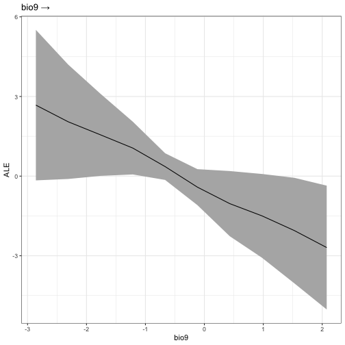
<p class="caption">plot of chunk unnamed-chunk-15</p>
</div>

```r
ALE(model_boot, variable = "bio12")
```

<div class="figure" style="text-align: center">
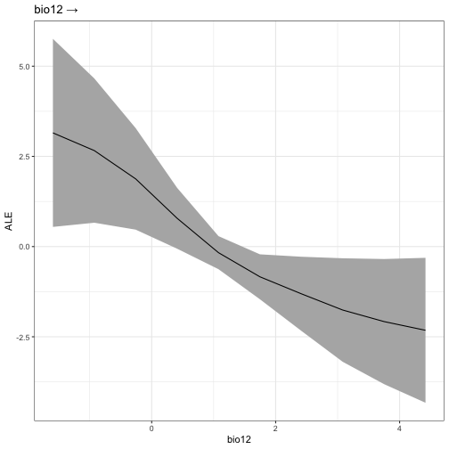
<p class="caption">plot of chunk unnamed-chunk-15</p>
</div>

```r
ALE(model_boot, variable = "bio14")
```

<div class="figure" style="text-align: center">
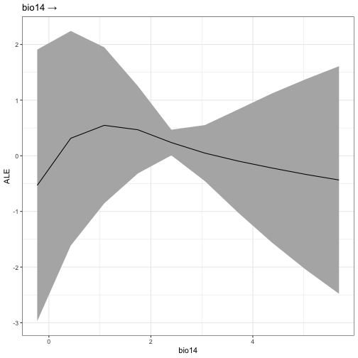
<p class="caption">plot of chunk unnamed-chunk-15</p>
</div>

```r
ALE(model_boot, variable = "bio16")
```

<div class="figure" style="text-align: center">
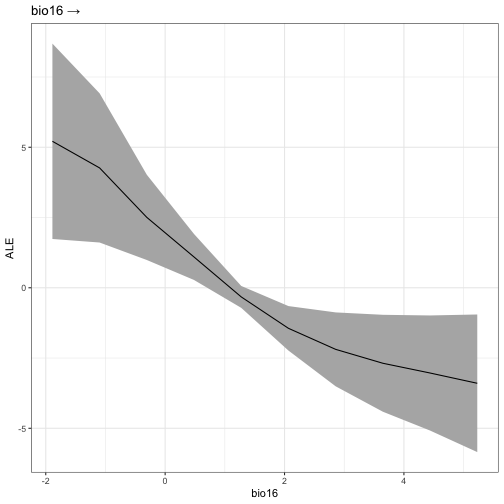
<p class="caption">plot of chunk unnamed-chunk-15</p>
</div>

## Multi-species distribution model

Cito supports many different loss functions which we can use to build multi-species distribution models (MSDM). MSDM are multi-label, i.e. they model and predict simoustanously many responses. We will use eucalypts data from [Pollock et al., 2014](https://besjournals.onlinelibrary.wiley.com/doi/10.1111/2041-210X.12180). The dataset has occurrence of 12 species over 458 sites.


```r
load(url("https://github.com/TheoreticalEcology/s-jSDM/raw/master/sjSDM/data/eucalypts.rda"))
# Environment
head(eucalypts$env)
#>   Rockiness Sandiness VallyBotFlat PPTann Loaminess cvTemp      T0
#> 1        60         1            0    785         0    142 6124.01
#> 2        75         1            0    785         0    142 6124.01
#> 3        70         1            0    780         0    142 3252.96
#> 4        40         1            0    778         0    142 1636.63
#> 5        15         1            0    772         0    142 1352.08
#> 6        80         1            0    841         0    142 5018.48

# PA
head(eucalypts$PA)
#>      ALA ARE BAX CAM GON MEL OBL OVA WIL ALP VIM ARO.SAB
#> [1,]   0   0   0   0   0   0   0   0   1   1   0       0
#> [2,]   0   0   0   0   0   0   1   0   1   1   0       0
#> [3,]   0   0   1   0   0   0   0   0   1   1   0       0
#> [4,]   0   0   1   0   0   0   0   0   1   0   0       0
#> [5,]   0   0   1   0   0   0   1   0   0   0   0       0
#> [6,]   0   0   0   0   0   0   0   0   1   1   0       0
```

Bring data into a format that is usable by cito:


```r
df = cbind(eucalypts$PA, scale(eucalypts$env))
head(df)
#>      ALA ARE BAX CAM GON MEL OBL OVA WIL ALP VIM ARO.SAB  Rockiness Sandiness
#> [1,]   0   0   0   0   0   0   0   0   1   1   0       0  1.0315338 0.5716827
#> [2,]   0   0   0   0   0   0   1   0   1   1   0       0  1.4558834 0.5716827
#> [3,]   0   0   1   0   0   0   0   0   1   1   0       0  1.3144335 0.5716827
#> [4,]   0   0   1   0   0   0   0   0   1   0   0       0  0.4657344 0.5716827
#> [5,]   0   0   1   0   0   0   1   0   0   0   0       0 -0.2415148 0.5716827
#> [6,]   0   0   0   0   0   0   0   0   1   1   0       0  1.5973333 0.5716827
#>      VallyBotFlat       PPTann  Loaminess    cvTemp         T0
#> [1,]   -0.5939667 -0.005981517 -0.2134535 -1.056073  0.5378148
#> [2,]   -0.5939667 -0.005981517 -0.2134535 -1.056073  0.5378148
#> [3,]   -0.5939667 -0.045456081 -0.2134535 -1.056073 -0.3404551
#> [4,]   -0.5939667 -0.061245907 -0.2134535 -1.056073 -0.8348993
#> [5,]   -0.5939667 -0.108615385 -0.2134535 -1.056073 -0.9219447
#> [6,]   -0.5939667  0.436133605 -0.2134535 -1.056073  0.1996271
```

We will use the binomial likelihood - each species occurrence data will be modeled by a binomial likelihood. Build simple model:


```r
model = dnn(cbind(ALA, ARE, BAX, CAM, GON, MEL, OBL, OVA, WIL, ALP, VIM, ARO.SAB)~.,
            data = df,
            verbose = FALSE,
            loss = "binomial")
```

<div class="figure" style="text-align: center">
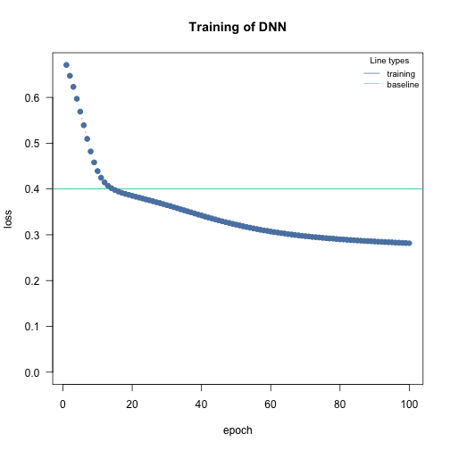
<p class="caption">plot of chunk unnamed-chunk-18</p>
</div>

Plot model:


```r
plot(model)
```

<div class="figure" style="text-align: center">
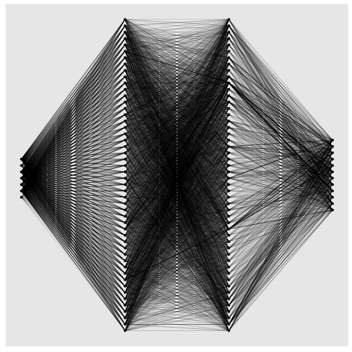
<p class="caption">plot of chunk unnamed-chunk-19</p>
</div>

Our NN has now 12 output nodes, one for each species.


```r
head(predict(model))
#>           [,1]      [,2]      [,3]      [,4]      [,5]      [,6]      [,7]
#> [1,] 0.1331459 0.1506837 0.3712408 0.1266095 0.1636752 0.1577358 0.2777096
#> [2,] 0.1354124 0.1515498 0.3678423 0.1258328 0.1674965 0.1612029 0.2709867
#> [3,] 0.1430002 0.1586185 0.3705418 0.1354483 0.1708843 0.1699892 0.2854469
#> [4,] 0.1441380 0.1626469 0.3770491 0.1422959 0.1663663 0.1707869 0.3097974
#> [5,] 0.1316050 0.1536373 0.3720362 0.1367511 0.1493681 0.1604599 0.3158411
#> [6,] 0.1474470 0.1606866 0.3695196 0.1303609 0.1647370 0.1688034 0.2734783
#>           [,8]      [,9]     [,10]     [,11]     [,12]
#> [1,] 0.1400767 0.2210456 0.1548240 0.1384140 0.2359208
#> [2,] 0.1430252 0.2149082 0.1569257 0.1350499 0.2325463
#> [3,] 0.1500368 0.2293961 0.1684729 0.1498935 0.2446437
#> [4,] 0.1489279 0.2433298 0.1748164 0.1617819 0.2582853
#> [5,] 0.1359103 0.2368087 0.1676515 0.1605706 0.2583595
#> [6,] 0.1479348 0.2197429 0.1721352 0.1455670 0.2426738
```

### Train model with bootstrapping


```r
model_boot = dnn(cbind(ALA, ARE, BAX, CAM, GON, MEL, OBL, OVA, WIL, ALP, VIM, ARO.SAB)~.,
                 data = df,
                 loss = "binomial",
                                  epochs = 200L,
                 hidden = c(50L, 50L),
                 batchsize = 50L,
                 lr = 0.05,
                 lambda = 0.001,
                 alpha = 1.0,
                 validation = 0.2,
                 verbose = FALSE,
                 lr_scheduler = config_lr_scheduler("reduce_on_plateau", patience = 7), # reduce learning rate each 7 epochs if the validation loss didn't decrease,
                 early_stopping = 14, # stop training when validation loss didn't decrease for 10 epochs
                 bootstrap = 20L,
                 bootstrap_parallel = 5L)
```

We haven't really adjusted the training procedure, so let's check the convergence first:


```r
analyze_training(model_boot)
```


### Inference


```r
results = summary(model_boot)
results
#> Summary of Deep Neural Network Model
#> 
#> ── Feature Importance
#>                        Importance   Std.Err Z value Pr(>|z|)    
#> Rockiness → ALA          0.003619  0.001864    1.94  0.05219 .  
#> Sandiness → ALA          0.000783  0.000766    1.02  0.30618    
#> VallyBotFlat → ALA       0.001516  0.000916    1.65  0.09800 .  
#> PPTann → ALA             0.001894  0.001368    1.38  0.16607    
#> Loaminess → ALA          0.000211  0.000401    0.53  0.59855    
#> cvTemp → ALA             0.002762  0.001103    2.50  0.01231 *  
#> T0 → ALA                 0.000810  0.000785    1.03  0.30159    
#>                                                                 
#> Rockiness → ARE          0.004982  0.002978    1.67  0.09433 .  
#> Sandiness → ARE          0.001133  0.000678    1.67  0.09436 .  
#> VallyBotFlat → ARE       0.001549  0.000885    1.75  0.07987 .  
#> PPTann → ARE             0.005463  0.003451    1.58  0.11340    
#> Loaminess → ARE          0.000352  0.000390    0.90  0.36618    
#> cvTemp → ARE             0.019921  0.009393    2.12  0.03394 *  
#> T0 → ARE                 0.001177  0.000759    1.55  0.12125    
#>                                                                 
#> Rockiness → BAX          0.011825  0.004278    2.76  0.00571 ** 
#> Sandiness → BAX          0.015052  0.005054    2.98  0.00290 ** 
#> VallyBotFlat → BAX       0.025689  0.007082    3.63  0.00029 ***
#> PPTann → BAX             0.006204  0.003091    2.01  0.04472 *  
#> Loaminess → BAX          0.000652  0.001189    0.55  0.58347    
#> cvTemp → BAX             0.027672  0.007689    3.60  0.00032 ***
#> T0 → BAX                 0.002229  0.001673    1.33  0.18278    
#>                                                                 
#> Rockiness → CAM         -0.001998  0.001371   -1.46  0.14498    
#> Sandiness → CAM          0.002721  0.002152    1.26  0.20614    
#> VallyBotFlat → CAM       0.004053  0.003475    1.17  0.24346    
#> PPTann → CAM            -0.001229  0.000830   -1.48  0.13855    
#> Loaminess → CAM          0.002104  0.001142    1.84  0.06552 .  
#> cvTemp → CAM             0.000206  0.000746    0.28  0.78255    
#> T0 → CAM                 0.000326  0.000753    0.43  0.66494    
#>                                                                 
#> Rockiness → GON          0.013798  0.005080    2.72  0.00661 ** 
#> Sandiness → GON          0.001339  0.001137    1.18  0.23884    
#> VallyBotFlat → GON       0.002640  0.001211    2.18  0.02931 *  
#> PPTann → GON             0.011291  0.006641    1.70  0.08912 .  
#> Loaminess → GON          0.000878  0.000699    1.26  0.20897    
#> cvTemp → GON             0.036310  0.012691    2.86  0.00422 ** 
#> T0 → GON                 0.002950  0.002164    1.36  0.17277    
#>                                                                 
#> Rockiness → MEL          0.001422  0.000954    1.49  0.13594    
#> Sandiness → MEL          0.001356  0.001177    1.15  0.24901    
#> VallyBotFlat → MEL       0.002419  0.000890    2.72  0.00659 ** 
#> PPTann → MEL             0.000984  0.000716    1.37  0.16965    
#> Loaminess → MEL          0.001687  0.000878    1.92  0.05475 .  
#> cvTemp → MEL             0.002220  0.000887    2.50  0.01233 *  
#> T0 → MEL                 0.000193  0.000720    0.27  0.78851    
#>                                                                 
#> Rockiness → OBL          0.007478  0.002261    3.31  0.00094 ***
#> Sandiness → OBL          0.003251  0.002462    1.32  0.18667    
#> VallyBotFlat → OBL       0.008817  0.003884    2.27  0.02322 *  
#> PPTann → OBL             0.003030  0.001498    2.02  0.04308 *  
#> Loaminess → OBL          0.004310  0.002999    1.44  0.15067    
#> cvTemp → OBL             0.014570  0.004999    2.91  0.00356 ** 
#> T0 → OBL                 0.000683  0.000642    1.06  0.28745    
#>                                                                 
#> Rockiness → OVA         -0.001070  0.001132   -0.95  0.34453    
#> Sandiness → OVA          0.002370  0.002074    1.14  0.25324    
#> VallyBotFlat → OVA       0.001578  0.002091    0.75  0.45044    
#> PPTann → OVA            -0.000866  0.000519   -1.67  0.09554 .  
#> Loaminess → OVA          0.001965  0.001245    1.58  0.11460    
#> cvTemp → OVA            -0.000151  0.000933   -0.16  0.87176    
#> T0 → OVA                 0.000650  0.000637    1.02  0.30741    
#>                                                                 
#> Rockiness → WIL          0.001518  0.001762    0.86  0.38907    
#> Sandiness → WIL          0.003695  0.002689    1.37  0.16947    
#> VallyBotFlat → WIL       0.007568  0.002785    2.72  0.00658 ** 
#> PPTann → WIL             0.002300  0.002199    1.05  0.29573    
#> Loaminess → WIL          0.000987  0.001455    0.68  0.49791    
#> cvTemp → WIL             0.021637  0.007195    3.01  0.00263 ** 
#> T0 → WIL                 0.000568  0.000851    0.67  0.50482    
#>                                                                 
#> Rockiness → ALP          0.028668  0.007622    3.76  0.00017 ***
#> Sandiness → ALP          0.000369  0.000630    0.59  0.55806    
#> VallyBotFlat → ALP      -0.000421  0.000753   -0.56  0.57628    
#> PPTann → ALP             0.018420  0.007969    2.31  0.02080 *  
#> Loaminess → ALP          0.000206  0.000641    0.32  0.74759    
#> cvTemp → ALP             0.002647  0.003227    0.82  0.41219    
#> T0 → ALP                 0.001402  0.001034    1.36  0.17507    
#>                                                                 
#> Rockiness → VIM         -0.001094  0.000919   -1.19  0.23403    
#> Sandiness → VIM          0.002926  0.001768    1.65  0.09807 .  
#> VallyBotFlat → VIM       0.001402  0.001558    0.90  0.36798    
#> PPTann → VIM            -0.000565  0.000989   -0.57  0.56794    
#> Loaminess → VIM          0.002348  0.001059    2.22  0.02658 *  
#> cvTemp → VIM             0.000153  0.001089    0.14  0.88850    
#> T0 → VIM                 0.000839  0.000771    1.09  0.27614    
#>                                                                 
#> Rockiness → ARO.SAB      0.004659  0.003103    1.50  0.13319    
#> Sandiness → ARO.SAB      0.001202  0.001698    0.71  0.47906    
#> VallyBotFlat → ARO.SAB   0.013144  0.005211    2.52  0.01165 *  
#> PPTann → ARO.SAB         0.002885  0.002019    1.43  0.15307    
#> Loaminess → ARO.SAB      0.001234  0.001446    0.85  0.39371    
#> cvTemp → ARO.SAB         0.008730  0.005054    1.73  0.08410 .  
#> T0 → ARO.SAB             0.000671  0.000757    0.89  0.37524    
#>                                                                 
#> ---
#> Signif. codes:  0 '***' 0.001 '**' 0.01 '*' 0.05 '.' 0.1 ' ' 1
#> 
#> ── Average Conditional Effects
#>                             ACE  Std.Err Z value Pr(>|z|)    
#> Rockiness → ALA         0.38638  0.10044    3.85  0.00012 ***
#> Sandiness → ALA        -0.08534  0.09429   -0.91  0.36545    
#> VallyBotFlat → ALA     -0.13216  0.09987   -1.32  0.18571    
#> PPTann → ALA            0.14897  0.10955    1.36  0.17388    
#> Loaminess → ALA         0.05421  0.10671    0.51  0.61142    
#> cvTemp → ALA            0.27413  0.12731    2.15  0.03131 *  
#> T0 → ALA                0.12298  0.07418    1.66  0.09736 .  
#>                                                              
#> Rockiness → ARE         0.45591  0.17718    2.57  0.01008 *  
#> Sandiness → ARE        -0.14356  0.12858   -1.12  0.26422    
#> VallyBotFlat → ARE     -0.00463  0.13143   -0.04  0.97191    
#> PPTann → ARE            0.01961  0.14749    0.13  0.89423    
#> Loaminess → ARE        -0.00684  0.15290   -0.04  0.96430    
#> cvTemp → ARE            0.90055  0.21830    4.13  3.7e-05 ***
#> T0 → ARE                0.02699  0.15583    0.17  0.86249    
#>                                                              
#> Rockiness → BAX        -0.17266  0.11303   -1.53  0.12664    
#> Sandiness → BAX         0.28455  0.09702    2.93  0.00336 ** 
#> VallyBotFlat → BAX     -0.39036  0.12228   -3.19  0.00141 ** 
#> PPTann → BAX           -0.00415  0.11407   -0.04  0.97100    
#> Loaminess → BAX         0.04300  0.12944    0.33  0.73972    
#> cvTemp → BAX           -0.55664  0.13789   -4.04  5.4e-05 ***
#> T0 → BAX                0.03305  0.11299    0.29  0.76988    
#>                                                              
#> Rockiness → CAM        -0.23775  0.15568   -1.53  0.12671    
#> Sandiness → CAM        -0.54049  0.13872   -3.90  9.8e-05 ***
#> VallyBotFlat → CAM      0.68820  0.17726    3.88  0.00010 ***
#> PPTann → CAM           -0.29762  0.10691   -2.78  0.00537 ** 
#> Loaminess → CAM         0.11166  0.16578    0.67  0.50058    
#> cvTemp → CAM            0.15978  0.16710    0.96  0.33900    
#> T0 → CAM                0.08186  0.09762    0.84  0.40168    
#>                                                              
#> Rockiness → GON         0.62604  0.16255    3.85  0.00012 ***
#> Sandiness → GON        -0.17588  0.14148   -1.24  0.21381    
#> VallyBotFlat → GON     -0.00874  0.16145   -0.05  0.95680    
#> PPTann → GON           -0.00840  0.16277   -0.05  0.95886    
#> Loaminess → GON        -0.02323  0.17957   -0.13  0.89707    
#> cvTemp → GON            1.07381  0.23793    4.51  6.4e-06 ***
#> T0 → GON               -0.02984  0.18643   -0.16  0.87283    
#>                                                              
#> Rockiness → MEL        -0.19363  0.13314   -1.45  0.14585    
#> Sandiness → MEL        -0.20730  0.11308   -1.83  0.06677 .  
#> VallyBotFlat → MEL      0.25939  0.13021    1.99  0.04636 *  
#> PPTann → MEL           -0.22225  0.09893   -2.25  0.02466 *  
#> Loaminess → MEL         0.03434  0.08568    0.40  0.68854    
#> cvTemp → MEL            0.13216  0.08233    1.61  0.10846    
#> T0 → MEL                0.10923  0.07008    1.56  0.11906    
#>                                                              
#> Rockiness → OBL        -0.34064  0.11636   -2.93  0.00342 ** 
#> Sandiness → OBL        -0.08633  0.07827   -1.10  0.27002    
#> VallyBotFlat → OBL     -0.02867  0.09324   -0.31  0.75851    
#> PPTann → OBL           -0.16181  0.10644   -1.52  0.12846    
#> Loaminess → OBL         0.23325  0.11389    2.05  0.04055 *  
#> cvTemp → OBL           -0.53143  0.16479   -3.22  0.00126 ** 
#> T0 → OBL                0.07144  0.07886    0.91  0.36497    
#>                                                              
#> Rockiness → OVA        -0.21563  0.14260   -1.51  0.13050    
#> Sandiness → OVA        -0.47427  0.13609   -3.49  0.00049 ***
#> VallyBotFlat → OVA      0.54488  0.14111    3.86  0.00011 ***
#> PPTann → OVA           -0.27086  0.09505   -2.85  0.00438 ** 
#> Loaminess → OVA         0.10945  0.17567    0.62  0.53325    
#> cvTemp → OVA            0.13613  0.17215    0.79  0.42907    
#> T0 → OVA                0.09831  0.08440    1.16  0.24409    
#>                                                              
#> Rockiness → WIL        -0.18174  0.14504   -1.25  0.21017    
#> Sandiness → WIL         0.05609  0.12743    0.44  0.65979    
#> VallyBotFlat → WIL     -0.11775  0.11770   -1.00  0.31708    
#> PPTann → WIL           -0.11010  0.14359   -0.77  0.44321    
#> Loaminess → WIL         0.22262  0.16279    1.37  0.17146    
#> cvTemp → WIL           -0.71307  0.18312   -3.89  9.9e-05 ***
#> T0 → WIL                0.06393  0.10309    0.62  0.53512    
#>                                                              
#> Rockiness → ALP         0.89909  0.14044    6.40  1.5e-10 ***
#> Sandiness → ALP         0.04449  0.12666    0.35  0.72539    
#> VallyBotFlat → ALP     -0.35504  0.19491   -1.82  0.06852 .  
#> PPTann → ALP            0.65946  0.18839    3.50  0.00046 ***
#> Loaminess → ALP         0.07186  0.15288    0.47  0.63831    
#> cvTemp → ALP            0.15023  0.21738    0.69  0.48949    
#> T0 → ALP                0.05299  0.09508    0.56  0.57727    
#>                                                              
#> Rockiness → VIM        -0.23640  0.15185   -1.56  0.11951    
#> Sandiness → VIM        -0.37271  0.11827   -3.15  0.00162 ** 
#> VallyBotFlat → VIM      0.41611  0.15003    2.77  0.00554 ** 
#> PPTann → VIM           -0.22563  0.10018   -2.25  0.02431 *  
#> Loaminess → VIM         0.08151  0.12587    0.65  0.51726    
#> cvTemp → VIM           -0.01863  0.16759   -0.11  0.91148    
#> T0 → VIM                0.10771  0.08118    1.33  0.18455    
#>                                                              
#> Rockiness → ARO.SAB    -0.57967  0.17028   -3.40  0.00066 ***
#> Sandiness → ARO.SAB    -0.24130  0.08623   -2.80  0.00514 ** 
#> VallyBotFlat → ARO.SAB  0.54026  0.14142    3.82  0.00013 ***
#> PPTann → ARO.SAB       -0.40656  0.10941   -3.72  0.00020 ***
#> Loaminess → ARO.SAB     0.14092  0.12096    1.17  0.24401    
#> cvTemp → ARO.SAB       -0.44971  0.18324   -2.45  0.01412 *  
#> T0 → ARO.SAB            0.05481  0.10188    0.54  0.59054    
#> ---
#> Signif. codes:  0 '***' 0.001 '**' 0.01 '*' 0.05 '.' 0.1 ' ' 1
#> 
#> ── Standard Deviation of Conditional Effects
#>                           ACE Std.Err Z value Pr(>|z|)    
#> Rockiness → ALA        0.2591  0.0527    4.92  8.7e-07 ***
#> Sandiness → ALA        0.1939  0.0282    6.87  6.5e-12 ***
#> VallyBotFlat → ALA     0.2105  0.0503    4.18  2.9e-05 ***
#> PPTann → ALA           0.1774  0.0557    3.18  0.00146 ** 
#> Loaminess → ALA        0.1306  0.0253    5.17  2.4e-07 ***
#> cvTemp → ALA           0.2478  0.0545    4.55  5.5e-06 ***
#> T0 → ALA               0.1373  0.0276    4.98  6.5e-07 ***
#>                                                           
#> Rockiness → ARE        0.3091  0.0911    3.39  0.00069 ***
#> Sandiness → ARE        0.2321  0.0571    4.06  4.9e-05 ***
#> VallyBotFlat → ARE     0.2467  0.0527    4.68  2.9e-06 ***
#> PPTann → ARE           0.2356  0.0791    2.98  0.00291 ** 
#> Loaminess → ARE        0.1581  0.0316    5.01  5.4e-07 ***
#> cvTemp → ARE           0.3095  0.0734    4.21  2.5e-05 ***
#> T0 → ARE               0.1639  0.0378    4.33  1.5e-05 ***
#>                                                           
#> Rockiness → BAX        0.1885  0.0449    4.20  2.7e-05 ***
#> Sandiness → BAX        0.1373  0.0308    4.46  8.1e-06 ***
#> VallyBotFlat → BAX     0.1842  0.0350    5.26  1.5e-07 ***
#> PPTann → BAX           0.1547  0.0320    4.84  1.3e-06 ***
#> Loaminess → BAX        0.0994  0.0269    3.70  0.00022 ***
#> cvTemp → BAX           0.1794  0.0445    4.03  5.7e-05 ***
#> T0 → BAX               0.1212  0.0287    4.23  2.4e-05 ***
#>                                                           
#> Rockiness → CAM        0.2785  0.0566    4.92  8.5e-07 ***
#> Sandiness → CAM        0.2672  0.0728    3.67  0.00024 ***
#> VallyBotFlat → CAM     0.2845  0.0612    4.65  3.3e-06 ***
#> PPTann → CAM           0.2413  0.0592    4.07  4.6e-05 ***
#> Loaminess → CAM        0.1696  0.0376    4.51  6.4e-06 ***
#> cvTemp → CAM           0.2805  0.0574    4.88  1.0e-06 ***
#> T0 → CAM               0.1725  0.0357    4.84  1.3e-06 ***
#>                                                           
#> Rockiness → GON        0.3301  0.0888    3.72  0.00020 ***
#> Sandiness → GON        0.2487  0.0701    3.54  0.00039 ***
#> VallyBotFlat → GON     0.2627  0.0600    4.38  1.2e-05 ***
#> PPTann → GON           0.2578  0.1033    2.50  0.01257 *  
#> Loaminess → GON        0.1720  0.0439    3.92  9.0e-05 ***
#> cvTemp → GON           0.3359  0.0807    4.16  3.1e-05 ***
#> T0 → GON               0.1843  0.0357    5.17  2.4e-07 ***
#>                                                           
#> Rockiness → MEL        0.2488  0.0537    4.64  3.6e-06 ***
#> Sandiness → MEL        0.2100  0.0557    3.77  0.00016 ***
#> VallyBotFlat → MEL     0.2384  0.0472    5.05  4.4e-07 ***
#> PPTann → MEL           0.2106  0.0633    3.33  0.00088 ***
#> Loaminess → MEL        0.1264  0.0298    4.24  2.3e-05 ***
#> cvTemp → MEL           0.2219  0.0468    4.74  2.1e-06 ***
#> T0 → MEL               0.1340  0.0329    4.07  4.6e-05 ***
#>                                                           
#> Rockiness → OBL        0.1841  0.0349    5.27  1.4e-07 ***
#> Sandiness → OBL        0.1358  0.0466    2.91  0.00358 ** 
#> VallyBotFlat → OBL     0.1825  0.0517    3.53  0.00041 ***
#> PPTann → OBL           0.1611  0.0452    3.56  0.00037 ***
#> Loaminess → OBL        0.0944  0.0246    3.84  0.00013 ***
#> cvTemp → OBL           0.1714  0.0356    4.82  1.4e-06 ***
#> T0 → OBL               0.1167  0.0403    2.90  0.00377 ** 
#>                                                           
#> Rockiness → OVA        0.2865  0.0539    5.31  1.1e-07 ***
#> Sandiness → OVA        0.2672  0.0677    3.95  7.9e-05 ***
#> VallyBotFlat → OVA     0.2880  0.0615    4.68  2.8e-06 ***
#> PPTann → OVA           0.2413  0.0553    4.36  1.3e-05 ***
#> Loaminess → OVA        0.1682  0.0374    4.49  7.0e-06 ***
#> cvTemp → OVA           0.2725  0.0609    4.47  7.7e-06 ***
#> T0 → OVA               0.1761  0.0396    4.45  8.5e-06 ***
#>                                                           
#> Rockiness → WIL        0.2321  0.0607    3.82  0.00013 ***
#> Sandiness → WIL        0.1848  0.0579    3.19  0.00142 ** 
#> VallyBotFlat → WIL     0.2332  0.0602    3.87  0.00011 ***
#> PPTann → WIL           0.2043  0.0466    4.38  1.2e-05 ***
#> Loaminess → WIL        0.1321  0.0358    3.69  0.00022 ***
#> cvTemp → WIL           0.2350  0.0557    4.22  2.5e-05 ***
#> T0 → WIL               0.1653  0.0454    3.64  0.00027 ***
#>                                                           
#> Rockiness → ALP        0.3128  0.0757    4.13  3.6e-05 ***
#> Sandiness → ALP        0.2113  0.0385    5.48  4.2e-08 ***
#> VallyBotFlat → ALP     0.2174  0.0565    3.84  0.00012 ***
#> PPTann → ALP           0.2034  0.0521    3.91  9.4e-05 ***
#> Loaminess → ALP        0.1687  0.0392    4.31  1.7e-05 ***
#> cvTemp → ALP           0.3183  0.0851    3.74  0.00018 ***
#> T0 → ALP               0.1829  0.0344    5.31  1.1e-07 ***
#>                                                           
#> Rockiness → VIM        0.2592  0.0505    5.14  2.8e-07 ***
#> Sandiness → VIM        0.2428  0.0570    4.26  2.1e-05 ***
#> VallyBotFlat → VIM     0.2631  0.0586    4.49  7.3e-06 ***
#> PPTann → VIM           0.2307  0.0487    4.74  2.2e-06 ***
#> Loaminess → VIM        0.1522  0.0326    4.67  3.0e-06 ***
#> cvTemp → VIM           0.2486  0.0584    4.26  2.0e-05 ***
#> T0 → VIM               0.1638  0.0408    4.01  6.0e-05 ***
#>                                                           
#> Rockiness → ARO.SAB    0.2265  0.0581    3.90  9.6e-05 ***
#> Sandiness → ARO.SAB    0.2040  0.0598    3.41  0.00065 ***
#> VallyBotFlat → ARO.SAB 0.2382  0.0672    3.55  0.00039 ***
#> PPTann → ARO.SAB       0.2217  0.0605    3.66  0.00025 ***
#> Loaminess → ARO.SAB    0.1396  0.0481    2.90  0.00374 ** 
#> cvTemp → ARO.SAB       0.2077  0.0464    4.48  7.6e-06 ***
#> T0 → ARO.SAB           0.1514  0.0305    4.97  6.7e-07 ***
#> ---
#> Signif. codes:  0 '***' 0.001 '**' 0.01 '*' 0.05 '.' 0.1 ' ' 1
```

cvTemp is significant for many species. Visualization of the effect:


```r
ale_plots = ALE(model_boot, variable = "cvTemp", plot = FALSE)
do.call(gridExtra::grid.arrange, ale_plots)
```

<div class="figure" style="text-align: center">
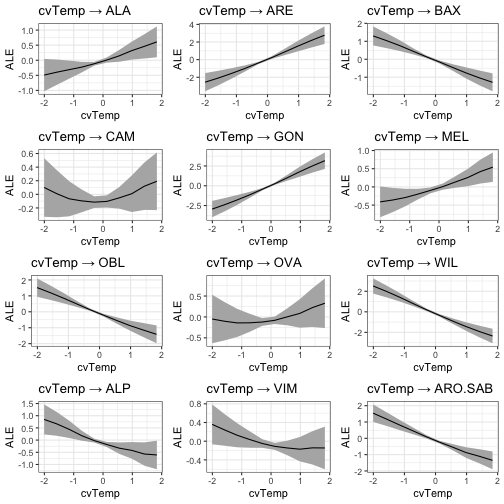
<p class="caption">plot of chunk unnamed-chunk-24</p>
</div>
