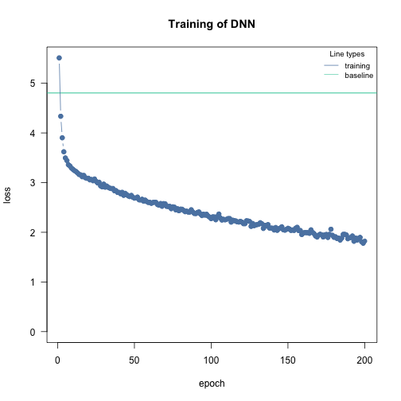
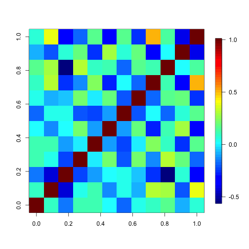

## Species distribution model - African elephant

The goal is to build a SDM for the African elephant. A pre-processed dataset from [Angelov, 2020](https://zenodo.org/record/4048271) can be found in the EcoData package which is only available on github:


```r
set.seed(1337)
if(!require(EcoData)) devtools::install_github(repo = "TheoreticalEcology/EcoData",
                         dependencies = FALSE, build_vignettes = FALSE)

library(EcoData)
df = EcoData::elephant$occurenceData
head(df)
#>       Presence       bio1       bio2       bio3       bio4        bio5       bio6       bio7       bio8       bio9       bio10       bio11      bio12
#> 3364         0 -0.4981747 -0.2738045  0.5368968 -0.5409999 -0.36843571  0.2947850 -0.5260099 -1.2253960  0.2494100 -0.64527314 -0.06267842  0.6285371
#> 6268         0  0.6085908 -0.5568352  1.0340686 -1.2492050 -0.11835651  0.8221087 -0.8938475  0.4233787  0.7746249  0.09168503  0.94419518  1.1121516
#> 10285        0 -0.7973005  1.4648130 -1.0540532  2.0759423  0.07614953 -1.5860029  1.6284678  0.2768209 -1.5153122 -0.03648161 -1.44165748 -1.2351482
#> 2247         0  0.6385034  1.3435141 -0.1591439 -0.5107148  1.10425291 -0.1622288  0.8577603  0.4600181  0.5855475  0.54026827  0.68153250  0.5951165
#> 9821         0  0.6684160 -0.6781341  0.6363311 -0.9906170  0.15950927  0.9099960 -0.8062671  0.3867393  0.8586593  0.31597665  0.94419518  1.1003561
#> 1351         0  0.9675418 -0.6781341 -0.3580126 -0.3748202  0.77081398  0.8748411 -0.3858812  0.3134604  1.0477367  0.98885151  0.94419518  0.7287986
#>            bio13       bio14        bio15      bio16      bio17       bio18       bio19
#> 3364   0.6807958 -0.29703736 -0.008455252  0.7124535 -0.2949994 -1.06812752  1.96201807
#> 6268   0.5918442  0.01619202 -0.884507980  0.5607328  0.3506918  1.22589281 -0.36205814
#> 10285 -1.3396742 -0.50585695  0.201797403 -1.3499999 -0.5616980 -0.42763181 -0.62895735
#> 2247   0.8714061 -0.55806185  0.236839512  1.1012378 -0.5616980 -0.20541902 -0.58378979
#> 9821   0.5537222  0.59044589 -1.024676416  0.6413344  0.7437213  0.06254347 -0.05409751
#> 1351   1.1255533 -0.50585695  0.236839512  1.2956300 -0.4494038 -0.90473576  2.47939193
```

Presence is our response variable and we have the 19 bioclim variables as features/predictors.

Let's split part of the data away so that we can use it at the end to evaluate our model:


```r
indices = sample.int(nrow(df), 300)
test = df[indices,]
df = df[-indices,]
```

### Adjusting optimization parameters - Convergence

We will first try a simple DNN with default values and the binomial likelihood. We use 30% of the data as validation holdout to check for overfitting:


```r
library(cito)
model = dnn(Presence~., data = df,
            batchsize = 100L,
            validation = 0.3, loss = "binomial",
            verbose = FALSE)
```


We see that the training and test losses were still decreasing which means we didn't train the model long enough. We could now either increase the number of epochs or increase the learning rate so that the model trains faster:


```r
model = dnn(Presence~., data = df,
            batchsize = 100L,
            lr = 0.05,
            validation = 0.3, loss = "binomial",
            verbose = FALSE)
```


Much better! But still now enough epochs. Also, let's see if we can further decrease the loss by using a wider and deeper neural network:


```r
model = dnn(Presence~., data = df,
            batchsize = 100L,
            hidden = c(100L, 100L, 100L),
            lr = 0.05,
            validation = 0.3, loss = "binomial",
            verbose = FALSE)
```


At the end of the training, the losses start to get jumpy, which can be a sign of potential overfitting. We can control that by adding a weak regularization (as we want a L2 regularization, we set alpha to 1.0):


```r
model = dnn(Presence~., data = df,
            batchsize = 100L,
            epochs = 150L,
            hidden = c(100L, 100L, 100L),
            lr = 0.05,
            lambda = 0.001,
            alpha = 1.0,
            validation = 0.3, loss = "binomial",
            verbose = FALSE)
```


We will turn on now advanced features that help with the convergence and to reduce overfitting:

-   learning rate scheduler - reduces learning rate during training

-   early stopping - stop training when validation loss starts to increase


```r
model = dnn(Presence~., data = df,
            batchsize = 100L,
            epochs = 150L,
            hidden = c(100L, 100L, 100L),
            lr = 0.05,
            lambda = 0.001,
            alpha = 1.0,
            validation = 0.3, loss = "binomial",
            verbose = FALSE,
            lr_scheduler = config_lr_scheduler("reduce_on_plateau", patience = 7), # reduce learning rate each 7 epochs if the validation loss didn't decrease,
            early_stopping = 14 # stop training when validation loss didn't decrease for 10 epochs
            )
```


Great! We found now a model architecture and training procedure that fits and trains well. Let's proceed to our final model

### Train final model with bootstrapping to obtain uncertainties

We haven't directly started with bootstrapping because it complicates the adjustment of the training procedure.

Uncertainties can be obtained by using bootstrapping. Be aware that this can be computational expensive:


```r
model_boot = dnn(Presence~., data = df,
                 batchsize = 100L,
                 epochs = 150L,
                 hidden = c(100L, 100L, 100L),
                 lr = 0.05,
                 lambda = 0.001,
                 alpha = 1.0,
                 validation = 0.3, loss = "binomial",
                 verbose = FALSE,
                 lr_scheduler = config_lr_scheduler("reduce_on_plateau", patience = 7), # reduce learning rate each 7 epochs if the validation loss didn't decrease,
                 early_stopping = 14, # stop training when validation loss didn't decrease for 10 epochs
                 bootstrap = 20L,
                 bootstrap_parallel = 5L
            )
```

### Predictions

We can use the model now for predictions:


```r
predictions = predict(model_boot, newdata = test, reduce = "none")
dim(predictions)
#> [1]  20 300   1
```

The predictions are 2/3 dimensional because of the bootstrapping. Calculate the AUC interval:


```r
hist(sapply(1:20, function(i) Metrics::auc(test$Presence, predictions[i,,])),
     xlim = c(0, 1), main = "AUC of ensemble model", xlab = "AUC")
```


We can now predict the habitat suitability of the elephant (Note that spatial dependencies are required):


```r
library(raster)
library(sp)
library(rsample)
library(latticeExtra)
library(sp)
library(ggplot2)
library(maptools)
customPredictFun = function(model, data) {
  return(apply(predict(model, data, reduce = "none"), 2:3, mean)[,1])
}

normalized_raster = EcoData::elephant$predictionData

predictions =
  raster::predict(normalized_raster,
                  model_boot,
                  fun = customPredictFun)

habitat_plot =
  spplot(predictions, colorkey = list(space = "left") )
habitat_plot
```


Moreover, we can visualize the uncertainty of our model, instead of calculating the average occurrence probability, we calculate for each prediction the standard deviation and visualize it:


```r
customPredictFun_sd = function(model, data) {
  return(apply(predict(model, data, reduce="none"), 2:3, sd)[,1])
}
predictions =
  raster::predict(normalized_raster,
                  model_boot,
                  fun = customPredictFun_sd)

uncertain_plot =
  spplot(predictions, colorkey = list(space = "left") )
uncertain_plot
```


### Inference

Neural networks are often called black-box models but the tools of explainable AI (xAI) allows us to understand them - and actually infer properties similar to what a linear regression model can provide (the calculation can take some time...):


```r
results = summary(model_boot)
results
#> Summary of Deep Neural Network Model
#> 
#> ── Feature Importance
#>          Importance Std.Err Z value Pr(>|z|)   
#> bio1 →        0.519   0.340    1.52   0.1276   
#> bio2 →        0.481   0.202    2.38   0.0171 * 
#> bio3 →        0.775   0.442    1.75   0.0793 . 
#> bio4 →        0.839   0.507    1.66   0.0979 . 
#> bio5 →        0.549   0.341    1.61   0.1073   
#> bio6 →        0.582   0.342    1.70   0.0882 . 
#> bio7 →        0.484   0.347    1.39   0.1637   
#> bio8 →        0.625   0.273    2.29   0.0221 * 
#> bio9 →        1.716   1.081    1.59   0.1123   
#> bio10 →       0.390   0.179    2.18   0.0293 * 
#> bio11 →       0.507   0.183    2.77   0.0056 **
#> bio12 →       1.068   0.456    2.34   0.0192 * 
#> bio13 →       0.352   0.183    1.92   0.0548 . 
#> bio14 →       0.693   0.524    1.32   0.1864   
#> bio15 →       0.870   0.380    2.29   0.0219 * 
#> bio16 →       1.924   1.333    1.44   0.1489   
#> bio17 →       0.243   0.105    2.33   0.0200 * 
#> bio18 →       1.056   0.434    2.44   0.0148 * 
#> bio19 →       0.333   0.151    2.20   0.0275 * 
#> ---
#> Signif. codes:  0 '***' 0.001 '**' 0.01 '*' 0.05 '.' 0.1 ' ' 1
#> 
#> ── Average Conditional Effects
#>               ACE  Std.Err Z value Pr(>|z|)   
#> bio1 →    0.03563  0.03647    0.98   0.3286   
#> bio2 →   -0.04601  0.02054   -2.24   0.0251 * 
#> bio3 →   -0.04048  0.02259   -1.79   0.0732 . 
#> bio4 →    0.02863  0.03175    0.90   0.3672   
#> bio5 →    0.04327  0.02822    1.53   0.1252   
#> bio6 →    0.04528  0.03452    1.31   0.1896   
#> bio7 →   -0.01664  0.02889   -0.58   0.5647   
#> bio8 →   -0.00863  0.02716   -0.32   0.7508   
#> bio9 →   -0.10926  0.04079   -2.68   0.0074 **
#> bio10 →   0.01877  0.03082    0.61   0.5425   
#> bio11 →   0.00514  0.03220    0.16   0.8731   
#> bio12 →  -0.07351  0.03605   -2.04   0.0414 * 
#> bio13 →   0.02796  0.02282    1.23   0.2204   
#> bio14 →   0.09733  0.03970    2.45   0.0142 * 
#> bio15 →  -0.02168  0.02395   -0.91   0.3654   
#> bio16 →  -0.10478  0.03290   -3.18   0.0014 **
#> bio17 →   0.02834  0.02008    1.41   0.1583   
#> bio18 →   0.03677  0.02043    1.80   0.0720 . 
#> bio19 →  -0.02506  0.02161   -1.16   0.2462   
#> ---
#> Signif. codes:  0 '***' 0.001 '**' 0.01 '*' 0.05 '.' 0.1 ' ' 1
#> 
#> ── Standard Deviation of Conditional Effects
#>             ACE Std.Err Z value Pr(>|z|)    
#> bio1 →   0.1040  0.0284    3.66  0.00025 ***
#> bio2 →   0.1059  0.0251    4.22  2.5e-05 ***
#> bio3 →   0.1095  0.0272    4.03  5.5e-05 ***
#> bio4 →   0.1136  0.0331    3.43  0.00060 ***
#> bio5 →   0.1047  0.0320    3.28  0.00105 ** 
#> bio6 →   0.0964  0.0331    2.91  0.00362 ** 
#> bio7 →   0.0770  0.0246    3.13  0.00175 ** 
#> bio8 →   0.1147  0.0210    5.46  4.8e-08 ***
#> bio9 →   0.1606  0.0482    3.33  0.00086 ***
#> bio10 →  0.0885  0.0244    3.63  0.00029 ***
#> bio11 →  0.1071  0.0213    5.04  4.7e-07 ***
#> bio12 →  0.1360  0.0302    4.50  6.9e-06 ***
#> bio13 →  0.0855  0.0244    3.50  0.00046 ***
#> bio14 →  0.1611  0.0577    2.79  0.00520 ** 
#> bio15 →  0.0978  0.0186    5.26  1.4e-07 ***
#> bio16 →  0.1732  0.0427    4.05  5.1e-05 ***
#> bio17 →  0.0852  0.0196    4.36  1.3e-05 ***
#> bio18 →  0.1951  0.0324    6.02  1.7e-09 ***
#> bio19 →  0.0838  0.0172    4.86  1.2e-06 ***
#> ---
#> Signif. codes:  0 '***' 0.001 '**' 0.01 '*' 0.05 '.' 0.1 ' ' 1
```

Bioclim9, 12, 14, and 16 have large significant average conditional effects (\$\\approx\$ linear effects). We can visualize them using accumulated local effect plots:


```r
par(mfrow = c(1, 4))
ALE(model_boot, variable = "bio9")
```


```r
ALE(model_boot, variable = "bio12")
```


```r
ALE(model_boot, variable = "bio14")
```


```r
ALE(model_boot, variable = "bio16")
```


## Multi-species distribution model

Cito supports many different loss functions which we can use to build multi-species distribution models (MSDM). MSDM are multi-label, i.e. they model and predict simultaneously many responses. We will use eucalypts data from [Pollock et al., 2014](https://besjournals.onlinelibrary.wiley.com/doi/10.1111/2041-210X.12180). The dataset has occurrence of 12 species over 458 sites.


```r
load(url("https://github.com/TheoreticalEcology/s-jSDM/raw/master/sjSDM/data/eucalypts.rda"))
# Environment
head(eucalypts$env)
#>   Rockiness Sandiness VallyBotFlat PPTann Loaminess cvTemp      T0
#> 1        60         1            0    785         0    142 6124.01
#> 2        75         1            0    785         0    142 6124.01
#> 3        70         1            0    780         0    142 3252.96
#> 4        40         1            0    778         0    142 1636.63
#> 5        15         1            0    772         0    142 1352.08
#> 6        80         1            0    841         0    142 5018.48

# PA
head(eucalypts$PA)
#>      ALA ARE BAX CAM GON MEL OBL OVA WIL ALP VIM ARO.SAB
#> [1,]   0   0   0   0   0   0   0   0   1   1   0       0
#> [2,]   0   0   0   0   0   0   1   0   1   1   0       0
#> [3,]   0   0   1   0   0   0   0   0   1   1   0       0
#> [4,]   0   0   1   0   0   0   0   0   1   0   0       0
#> [5,]   0   0   1   0   0   0   1   0   0   0   0       0
#> [6,]   0   0   0   0   0   0   0   0   1   1   0       0
```

Bring data into a format that is usable by cito:


```r
df = cbind(eucalypts$PA, scale(eucalypts$env))
head(df)
#>      ALA ARE BAX CAM GON MEL OBL OVA WIL ALP VIM ARO.SAB  Rockiness Sandiness VallyBotFlat       PPTann  Loaminess    cvTemp         T0
#> [1,]   0   0   0   0   0   0   0   0   1   1   0       0  1.0315338 0.5716827   -0.5939667 -0.005981517 -0.2134535 -1.056073  0.5378148
#> [2,]   0   0   0   0   0   0   1   0   1   1   0       0  1.4558834 0.5716827   -0.5939667 -0.005981517 -0.2134535 -1.056073  0.5378148
#> [3,]   0   0   1   0   0   0   0   0   1   1   0       0  1.3144335 0.5716827   -0.5939667 -0.045456081 -0.2134535 -1.056073 -0.3404551
#> [4,]   0   0   1   0   0   0   0   0   1   0   0       0  0.4657344 0.5716827   -0.5939667 -0.061245907 -0.2134535 -1.056073 -0.8348993
#> [5,]   0   0   1   0   0   0   1   0   0   0   0       0 -0.2415148 0.5716827   -0.5939667 -0.108615385 -0.2134535 -1.056073 -0.9219447
#> [6,]   0   0   0   0   0   0   0   0   1   1   0       0  1.5973333 0.5716827   -0.5939667  0.436133605 -0.2134535 -1.056073  0.1996271
```

We will use the binomial likelihood - each species occurrence data will be modelled by a binomial likelihood. Build simple model:


```r
model = dnn(cbind(ALA, ARE, BAX, CAM, GON, MEL, OBL, OVA, WIL, ALP, VIM, ARO.SAB)~.,
            data = df,
            lr = 0.1,
            verbose = FALSE,
            loss = "binomial")
```


Plot model:


```r
plot(model)
```


Our NN has now 12 output nodes, one for each species.


```r
head(predict(model))
#>           [,1]      [,2]        [,3]      [,4]      [,5]      [,6]        [,7]      [,8]       [,9]      [,10]     [,11]     [,12]
#> [1,] -1.946043 -3.670648  0.37782085 -4.861333 -4.125144 -2.968839 -0.94163764 -4.436732 -0.7886785 -0.9779580 -3.598855 -2.911928
#> [2,] -1.628756 -3.361437  0.07032853 -5.203188 -3.702430 -3.160629 -1.26876736 -4.794323 -1.1171856 -0.3598964 -3.970761 -3.538618
#> [3,] -1.955254 -3.792130  0.20341921 -5.260411 -4.135300 -3.265577 -1.14787960 -4.860140 -0.9366873 -0.7705419 -3.988610 -3.320937
#> [4,] -2.757299 -4.635928  0.75516909 -4.703501 -5.214269 -3.009679 -0.52837741 -4.233300 -0.3579682 -2.2619901 -3.367687 -2.144249
#> [5,] -3.451557 -5.391349  1.07802486 -4.150752 -6.336981 -2.739220 -0.07294691 -3.689935  0.0051063 -3.5920491 -2.808322 -1.043708
#> [6,] -1.622271 -3.574191 -0.11181535 -5.837625 -3.900543 -3.567721 -1.51196790 -5.443764 -1.3404803  0.0549444 -4.501054 -4.139803
```

### Train model with bootstrapping


```r
model_boot = dnn(cbind(ALA, ARE, BAX, CAM, GON, MEL, OBL, OVA, WIL, ALP, VIM, ARO.SAB)~.,
                 data = df,
                 loss = "binomial",
                                  epochs = 200L,
                 hidden = c(50L, 50L),
                 batchsize = 50L,
                 lr = 0.1,
                 lambda = 0.001,
                 alpha = 1.0,
                 validation = 0.2,
                 verbose = FALSE,
                 lr_scheduler = config_lr_scheduler("reduce_on_plateau", patience = 7), # reduce learning rate each 7 epochs if the validation loss didn't decrease,
                 early_stopping = 14, # stop training when validation loss didn't decrease for 10 epochs
                 bootstrap = 20L,
                 bootstrap_parallel = 5L)
```

We haven't really adjusted the training procedure, so let's check the convergence first:


```r
analyze_training(model_boot)
```


### Inference


```r
results = summary(model_boot)
results
#> Summary of Deep Neural Network Model
#> 
#> ── Feature Importance
#>                        Importance Std.Err Z value Pr(>|z|)    
#> Rockiness → ALA           0.11286 0.06659    1.69  0.09013 .  
#> Sandiness → ALA           0.01438 0.01642    0.88  0.38102    
#> VallyBotFlat → ALA        0.07613 0.03573    2.13  0.03312 *  
#> PPTann → ALA              0.04908 0.01883    2.61  0.00913 ** 
#> Loaminess → ALA           0.01571 0.00779    2.02  0.04380 *  
#> cvTemp → ALA              0.06628 0.03240    2.05  0.04081 *  
#> T0 → ALA                  0.03603 0.03359    1.07  0.28345    
#>                                                               
#> Rockiness → ARE           0.08656 0.04479    1.93  0.05330 .  
#> Sandiness → ARE           0.03791 0.02584    1.47  0.14229    
#> VallyBotFlat → ARE        0.07793 0.04800    1.62  0.10446    
#> PPTann → ARE              0.10784 0.08581    1.26  0.20882    
#> Loaminess → ARE           0.03539 0.02141    1.65  0.09836 .  
#> cvTemp → ARE              1.12350 0.32904    3.41  0.00064 ***
#> T0 → ARE                  0.07027 0.04535    1.55  0.12129    
#>                                                               
#> Rockiness → BAX           0.08236 0.03388    2.43  0.01506 *  
#> Sandiness → BAX           0.09753 0.03944    2.47  0.01340 *  
#> VallyBotFlat → BAX        0.16518 0.04125    4.00  6.2e-05 ***
#> PPTann → BAX              0.04089 0.01457    2.81  0.00500 ** 
#> Loaminess → BAX           0.00900 0.00635    1.42  0.15605    
#> cvTemp → BAX              0.22186 0.07316    3.03  0.00243 ** 
#> T0 → BAX                  0.01278 0.00781    1.64  0.10173    
#>                                                               
#> Rockiness → CAM           0.06070 0.04026    1.51  0.13160    
#> Sandiness → CAM           0.21651 0.07923    2.73  0.00628 ** 
#> VallyBotFlat → CAM        0.32253 0.14807    2.18  0.02939 *  
#> PPTann → CAM              0.05370 0.02569    2.09  0.03662 *  
#> Loaminess → CAM           0.03572 0.02543    1.40  0.16009    
#> cvTemp → CAM              0.05964 0.01467    4.06  4.8e-05 ***
#> T0 → CAM                  0.02342 0.02281    1.03  0.30441    
#>                                                               
#> Rockiness → GON           0.38192 0.15210    2.51  0.01204 *  
#> Sandiness → GON           0.03712 0.03254    1.14  0.25400    
#> VallyBotFlat → GON        0.12841 0.06226    2.06  0.03918 *  
#> PPTann → GON              0.29667 0.18920    1.57  0.11687    
#> Loaminess → GON           0.05948 0.03880    1.53  0.12524    
#> cvTemp → GON              2.40360 1.02325    2.35  0.01882 *  
#> T0 → GON                  0.09493 0.06313    1.50  0.13268    
#>                                                               
#> Rockiness → MEL           0.13064 0.05805    2.25  0.02442 *  
#> Sandiness → MEL           0.02030 0.01802    1.13  0.26006    
#> VallyBotFlat → MEL        0.03257 0.01348    2.42  0.01564 *  
#> PPTann → MEL              0.07856 0.02778    2.83  0.00468 ** 
#> Loaminess → MEL           0.02654 0.01433    1.85  0.06403 .  
#> cvTemp → MEL              0.06843 0.02920    2.34  0.01911 *  
#> T0 → MEL                  0.01325 0.01654    0.80  0.42327    
#>                                                               
#> Rockiness → OBL           0.11849 0.05061    2.34  0.01921 *  
#> Sandiness → OBL           0.02803 0.01357    2.06  0.03893 *  
#> VallyBotFlat → OBL        0.08064 0.04413    1.83  0.06765 .  
#> PPTann → OBL              0.03564 0.01963    1.82  0.06938 .  
#> Loaminess → OBL           0.04208 0.02873    1.46  0.14308    
#> cvTemp → OBL              0.23240 0.10248    2.27  0.02335 *  
#> T0 → OBL                  0.01138 0.01070    1.06  0.28742    
#>                                                               
#> Rockiness → OVA           0.08659 0.03503    2.47  0.01344 *  
#> Sandiness → OVA           0.13489 0.05371    2.51  0.01202 *  
#> VallyBotFlat → OVA        0.13749 0.04899    2.81  0.00501 ** 
#> PPTann → OVA              0.04782 0.02411    1.98  0.04734 *  
#> Loaminess → OVA           0.03219 0.02400    1.34  0.17985    
#> cvTemp → OVA              0.03461 0.03626    0.95  0.33983    
#> T0 → OVA                  0.01781 0.01241    1.43  0.15134    
#>                                                               
#> Rockiness → WIL           0.03851 0.02624    1.47  0.14228    
#> Sandiness → WIL           0.03260 0.02736    1.19  0.23343    
#> VallyBotFlat → WIL        0.07455 0.03421    2.18  0.02934 *  
#> PPTann → WIL              0.04327 0.02261    1.91  0.05566 .  
#> Loaminess → WIL           0.03116 0.04275    0.73  0.46615    
#> cvTemp → WIL              0.57470 0.13153    4.37  1.2e-05 ***
#> T0 → WIL                  0.01031 0.01028    1.00  0.31598    
#>                                                               
#> Rockiness → ALP           1.38556 0.52119    2.66  0.00785 ** 
#> Sandiness → ALP           0.04548 0.04099    1.11  0.26724    
#> VallyBotFlat → ALP        0.10718 0.06870    1.56  0.11872    
#> PPTann → ALP              0.62295 0.21141    2.95  0.00321 ** 
#> Loaminess → ALP           0.01321 0.01419    0.93  0.35185    
#> cvTemp → ALP              0.08627 0.07230    1.19  0.23277    
#> T0 → ALP                  0.04823 0.02955    1.63  0.10265    
#>                                                               
#> Rockiness → VIM           0.08630 0.02745    3.14  0.00167 ** 
#> Sandiness → VIM           0.09089 0.05758    1.58  0.11444    
#> VallyBotFlat → VIM        0.05370 0.02842    1.89  0.05880 .  
#> PPTann → VIM              0.04705 0.02021    2.33  0.01989 *  
#> Loaminess → VIM           0.03529 0.01409    2.50  0.01227 *  
#> cvTemp → VIM              0.03978 0.01194    3.33  0.00087 ***
#> T0 → VIM                  0.02674 0.02657    1.01  0.31419    
#>                                                               
#> Rockiness → ARO.SAB       0.23736 0.06424    3.69  0.00022 ***
#> Sandiness → ARO.SAB       0.02608 0.01403    1.86  0.06303 .  
#> VallyBotFlat → ARO.SAB    0.14835 0.06571    2.26  0.02396 *  
#> PPTann → ARO.SAB          0.10365 0.05115    2.03  0.04274 *  
#> Loaminess → ARO.SAB       0.00712 0.00814    0.87  0.38173    
#> cvTemp → ARO.SAB          0.19058 0.07141    2.67  0.00761 ** 
#> T0 → ARO.SAB              0.01767 0.00984    1.80  0.07249 .  
#>                                                               
#> ---
#> Signif. codes:  0 '***' 0.001 '**' 0.01 '*' 0.05 '.' 0.1 ' ' 1
#> 
#> ── Average Conditional Effects
#>                              ACE   Std.Err Z value Pr(>|z|)    
#> Rockiness → ALA         3.17e-02  9.45e-03    3.35  0.00081 ***
#> Sandiness → ALA        -6.10e-03  8.21e-03   -0.74  0.45780    
#> VallyBotFlat → ALA     -1.38e-02  9.18e-03   -1.51  0.13199    
#> PPTann → ALA            1.50e-02  8.58e-03    1.75  0.07953 .  
#> Loaminess → ALA         3.09e-03  7.39e-03    0.42  0.67561    
#> cvTemp → ALA            1.96e-02  8.19e-03    2.40  0.01657 *  
#> T0 → ALA                1.62e-02  8.17e-03    1.99  0.04664 *  
#>                                                                
#> Rockiness → ARE         2.10e-02  8.14e-03    2.58  0.00993 ** 
#> Sandiness → ARE        -4.76e-03  6.86e-03   -0.69  0.48770    
#> VallyBotFlat → ARE     -5.79e-03  1.09e-02   -0.53  0.59637    
#> PPTann → ARE           -8.09e-03  8.16e-03   -0.99  0.32136    
#> Loaminess → ARE        -2.99e-03  8.03e-03   -0.37  0.70979    
#> cvTemp → ARE            6.59e-02  1.19e-02    5.56  2.7e-08 ***
#> T0 → ARE                4.65e-03  6.39e-03    0.73  0.46650    
#>                                                                
#> Rockiness → BAX        -4.08e-02  2.25e-02   -1.81  0.06970 .  
#> Sandiness → BAX         6.28e-02  1.82e-02    3.45  0.00056 ***
#> VallyBotFlat → BAX     -7.87e-02  1.36e-02   -5.78  7.6e-09 ***
#> PPTann → BAX            1.13e-02  2.19e-02    0.51  0.60682    
#> Loaminess → BAX         5.42e-03  2.72e-02    0.20  0.84216    
#> cvTemp → BAX           -1.25e-01  2.03e-02   -6.17  6.6e-10 ***
#> T0 → BAX                2.77e-03  1.62e-02    0.17  0.86434    
#>                                                                
#> Rockiness → CAM        -7.60e-03  8.14e-03   -0.93  0.35062    
#> Sandiness → CAM        -3.03e-02  6.06e-03   -5.00  5.8e-07 ***
#> VallyBotFlat → CAM      3.95e-02  8.35e-03    4.72  2.3e-06 ***
#> PPTann → CAM           -1.13e-02  8.21e-03   -1.38  0.16717    
#> Loaminess → CAM         3.56e-03  8.81e-03    0.40  0.68623    
#> cvTemp → CAM            7.39e-03  9.20e-03    0.80  0.42171    
#> T0 → CAM                1.05e-03  6.36e-03    0.17  0.86820    
#>                                                                
#> Rockiness → GON         3.12e-02  8.11e-03    3.85  0.00012 ***
#> Sandiness → GON        -4.98e-03  7.76e-03   -0.64  0.52152    
#> VallyBotFlat → GON     -6.10e-03  1.18e-02   -0.52  0.60587    
#> PPTann → GON           -1.21e-02  7.45e-03   -1.62  0.10541    
#> Loaminess → GON        -4.21e-03  8.66e-03   -0.49  0.62698    
#> cvTemp → GON            6.88e-02  1.04e-02    6.63  3.3e-11 ***
#> T0 → GON               -7.75e-04  6.82e-03   -0.11  0.90950    
#>                                                                
#> Rockiness → MEL        -2.49e-02  1.12e-02   -2.22  0.02670 *  
#> Sandiness → MEL        -8.12e-03  7.99e-03   -1.02  0.30902    
#> VallyBotFlat → MEL      1.38e-02  9.14e-03    1.51  0.13043    
#> PPTann → MEL           -2.08e-02  8.30e-03   -2.51  0.01207 *  
#> Loaminess → MEL         2.45e-03  9.68e-03    0.25  0.80037    
#> cvTemp → MEL            1.55e-02  1.27e-02    1.22  0.22140    
#> T0 → MEL                1.27e-02  7.99e-03    1.59  0.11241    
#>                                                                
#> Rockiness → OBL        -6.22e-02  2.39e-02   -2.61  0.00918 ** 
#> Sandiness → OBL        -1.65e-02  1.44e-02   -1.14  0.25306    
#> VallyBotFlat → OBL     -2.04e-02  1.96e-02   -1.04  0.29878    
#> PPTann → OBL           -1.32e-02  1.68e-02   -0.79  0.43052    
#> Loaminess → OBL         4.48e-02  1.89e-02    2.37  0.01761 *  
#> cvTemp → OBL           -1.18e-01  2.90e-02   -4.07  4.7e-05 ***
#> T0 → OBL                2.69e-03  1.37e-02    0.20  0.84448    
#>                                                                
#> Rockiness → OVA        -9.60e-03  7.45e-03   -1.29  0.19780    
#> Sandiness → OVA        -2.44e-02  6.39e-03   -3.82  0.00013 ***
#> VallyBotFlat → OVA      2.78e-02  7.64e-03    3.64  0.00027 ***
#> PPTann → OVA           -1.04e-02  7.54e-03   -1.38  0.16876    
#> Loaminess → OVA         1.75e-03  7.79e-03    0.23  0.82195    
#> cvTemp → OVA            9.18e-03  1.02e-02    0.90  0.36878    
#> T0 → OVA                6.18e-03  5.15e-03    1.20  0.23006    
#>                                                                
#> Rockiness → WIL        -1.27e-02  1.66e-02   -0.77  0.44336    
#> Sandiness → WIL         5.71e-03  1.30e-02    0.44  0.66109    
#> VallyBotFlat → WIL     -1.40e-02  1.22e-02   -1.15  0.25079    
#> PPTann → WIL           -1.62e-03  1.17e-02   -0.14  0.88995    
#> Loaminess → WIL         2.66e-02  1.79e-02    1.49  0.13631    
#> cvTemp → WIL           -1.20e-01  2.19e-02   -5.50  3.9e-08 ***
#> T0 → WIL                1.98e-05  1.22e-02    0.00  0.99870    
#>                                                                
#> Rockiness → ALP         6.28e-02  6.81e-03    9.22  < 2e-16 ***
#> Sandiness → ALP         2.39e-03  7.32e-03    0.33  0.74417    
#> VallyBotFlat → ALP     -1.39e-02  1.32e-02   -1.05  0.29437    
#> PPTann → ALP            4.79e-02  7.63e-03    6.28  3.4e-10 ***
#> Loaminess → ALP         5.30e-03  8.39e-03    0.63  0.52751    
#> cvTemp → ALP           -8.16e-03  1.20e-02   -0.68  0.49541    
#> T0 → ALP                2.40e-03  6.42e-03    0.37  0.70832    
#>                                                                
#> Rockiness → VIM        -1.54e-02  8.72e-03   -1.77  0.07685 .  
#> Sandiness → VIM        -2.56e-02  7.31e-03   -3.50  0.00047 ***
#> VallyBotFlat → VIM      2.44e-02  6.86e-03    3.55  0.00039 ***
#> PPTann → VIM           -1.12e-02  6.61e-03   -1.70  0.08979 .  
#> Loaminess → VIM         2.19e-03  6.36e-03    0.34  0.73084    
#> cvTemp → VIM           -5.03e-03  7.77e-03   -0.65  0.51749    
#> T0 → VIM                7.72e-03  7.77e-03    0.99  0.32020    
#>                                                                
#> Rockiness → ARO.SAB    -8.58e-02  2.15e-02   -3.99  6.5e-05 ***
#> Sandiness → ARO.SAB    -2.07e-02  1.54e-02   -1.34  0.17872    
#> VallyBotFlat → ARO.SAB  7.57e-02  1.52e-02    4.97  6.5e-07 ***
#> PPTann → ARO.SAB       -4.94e-02  2.15e-02   -2.30  0.02131 *  
#> Loaminess → ARO.SAB     1.34e-02  1.20e-02    1.12  0.26268    
#> cvTemp → ARO.SAB       -8.22e-02  2.39e-02   -3.44  0.00057 ***
#> T0 → ARO.SAB           -1.02e-02  1.24e-02   -0.82  0.41123    
#> ---
#> Signif. codes:  0 '***' 0.001 '**' 0.01 '*' 0.05 '.' 0.1 ' ' 1
#> 
#> ── Standard Deviation of Conditional Effects
#>                            ACE Std.Err Z value Pr(>|z|)    
#> Rockiness → ALA        0.02885 0.00673    4.29  1.8e-05 ***
#> Sandiness → ALA        0.01701 0.00494    3.44  0.00058 ***
#> VallyBotFlat → ALA     0.01607 0.00436    3.69  0.00023 ***
#> PPTann → ALA           0.01990 0.00456    4.36  1.3e-05 ***
#> Loaminess → ALA        0.00991 0.00315    3.15  0.00164 ** 
#> cvTemp → ALA           0.02611 0.00648    4.03  5.5e-05 ***
#> T0 → ALA               0.01668 0.00546    3.06  0.00224 ** 
#>                                                            
#> Rockiness → ARE        0.04648 0.00685    6.79  1.1e-11 ***
#> Sandiness → ARE        0.02550 0.00445    5.73  1.0e-08 ***
#> VallyBotFlat → ARE     0.02713 0.00745    3.64  0.00027 ***
#> PPTann → ARE           0.03211 0.00711    4.52  6.2e-06 ***
#> Loaminess → ARE        0.01604 0.00418    3.83  0.00013 ***
#> cvTemp → ARE           0.06891 0.01222    5.64  1.7e-08 ***
#> T0 → ARE               0.02014 0.00449    4.49  7.2e-06 ***
#>                                                            
#> Rockiness → BAX        0.04944 0.01052    4.70  2.6e-06 ***
#> Sandiness → BAX        0.04284 0.00974    4.40  1.1e-05 ***
#> VallyBotFlat → BAX     0.05593 0.00631    8.87  < 2e-16 ***
#> PPTann → BAX           0.04379 0.01294    3.39  0.00071 ***
#> Loaminess → BAX        0.02237 0.00648    3.45  0.00056 ***
#> cvTemp → BAX           0.07349 0.01293    5.68  1.3e-08 ***
#> T0 → BAX               0.02440 0.00506    4.82  1.4e-06 ***
#>                                                            
#> Rockiness → CAM        0.01952 0.00518    3.77  0.00016 ***
#> Sandiness → CAM        0.03523 0.00591    5.96  2.5e-09 ***
#> VallyBotFlat → CAM     0.04022 0.00960    4.19  2.8e-05 ***
#> PPTann → CAM           0.01865 0.00649    2.87  0.00406 ** 
#> Loaminess → CAM        0.01661 0.00504    3.29  0.00099 ***
#> cvTemp → CAM           0.02847 0.00701    4.06  4.8e-05 ***
#> T0 → CAM               0.02156 0.00519    4.15  3.3e-05 ***
#>                                                            
#> Rockiness → GON        0.06172 0.01062    5.81  6.2e-09 ***
#> Sandiness → GON        0.02732 0.00557    4.91  9.2e-07 ***
#> VallyBotFlat → GON     0.03065 0.00707    4.33  1.5e-05 ***
#> PPTann → GON           0.03392 0.00696    4.87  1.1e-06 ***
#> Loaminess → GON        0.01788 0.00568    3.15  0.00165 ** 
#> cvTemp → GON           0.08644 0.01398    6.18  6.2e-10 ***
#> T0 → GON               0.02224 0.00449    4.96  7.2e-07 ***
#>                                                            
#> Rockiness → MEL        0.02617 0.00748    3.50  0.00047 ***
#> Sandiness → MEL        0.02582 0.00602    4.29  1.8e-05 ***
#> VallyBotFlat → MEL     0.03015 0.00648    4.66  3.2e-06 ***
#> PPTann → MEL           0.02313 0.00613    3.77  0.00016 ***
#> Loaminess → MEL        0.01222 0.00341    3.59  0.00033 ***
#> cvTemp → MEL           0.02928 0.00687    4.26  2.0e-05 ***
#> T0 → MEL               0.01805 0.00673    2.68  0.00732 ** 
#>                                                            
#> Rockiness → OBL        0.04990 0.01462    3.41  0.00064 ***
#> Sandiness → OBL        0.03619 0.00990    3.65  0.00026 ***
#> VallyBotFlat → OBL     0.05168 0.01119    4.62  3.8e-06 ***
#> PPTann → OBL           0.03973 0.01126    3.53  0.00042 ***
#> Loaminess → OBL        0.02951 0.01098    2.69  0.00721 ** 
#> cvTemp → OBL           0.07360 0.02228    3.30  0.00095 ***
#> T0 → OBL               0.02441 0.00691    3.53  0.00041 ***
#>                                                            
#> Rockiness → OVA        0.01750 0.00419    4.17  3.0e-05 ***
#> Sandiness → OVA        0.02538 0.00682    3.72  0.00020 ***
#> VallyBotFlat → OVA     0.02739 0.00641    4.27  1.9e-05 ***
#> PPTann → OVA           0.01602 0.00578    2.77  0.00562 ** 
#> Loaminess → OVA        0.01290 0.00340    3.80  0.00015 ***
#> cvTemp → OVA           0.02467 0.01040    2.37  0.01773 *  
#> T0 → OVA               0.01875 0.00568    3.30  0.00096 ***
#>                                                            
#> Rockiness → WIL        0.04211 0.00677    6.22  4.9e-10 ***
#> Sandiness → WIL        0.03298 0.00738    4.47  8.0e-06 ***
#> VallyBotFlat → WIL     0.04274 0.00736    5.81  6.4e-09 ***
#> PPTann → WIL           0.03817 0.00986    3.87  0.00011 ***
#> Loaminess → WIL        0.02753 0.01079    2.55  0.01075 *  
#> cvTemp → WIL           0.09439 0.02176    4.34  1.4e-05 ***
#> T0 → WIL               0.02853 0.00707    4.04  5.4e-05 ***
#>                                                            
#> Rockiness → ALP        0.08221 0.01477    5.57  2.6e-08 ***
#> Sandiness → ALP        0.01849 0.00635    2.91  0.00360 ** 
#> VallyBotFlat → ALP     0.02773 0.01176    2.36  0.01831 *  
#> PPTann → ALP           0.06677 0.01232    5.42  6.0e-08 ***
#> Loaminess → ALP        0.01923 0.00732    2.63  0.00858 ** 
#> cvTemp → ALP           0.04764 0.01188    4.01  6.1e-05 ***
#> T0 → ALP               0.02659 0.00785    3.39  0.00070 ***
#>                                                            
#> Rockiness → VIM        0.01982 0.00573    3.46  0.00053 ***
#> Sandiness → VIM        0.02533 0.00584    4.34  1.4e-05 ***
#> VallyBotFlat → VIM     0.02822 0.00652    4.33  1.5e-05 ***
#> PPTann → VIM           0.01756 0.00496    3.54  0.00040 ***
#> Loaminess → VIM        0.01190 0.00300    3.96  7.5e-05 ***
#> cvTemp → VIM           0.02317 0.00510    4.54  5.6e-06 ***
#> T0 → VIM               0.01986 0.00739    2.69  0.00718 ** 
#>                                                            
#> Rockiness → ARO.SAB    0.06740 0.01771    3.81  0.00014 ***
#> Sandiness → ARO.SAB    0.04663 0.00973    4.79  1.6e-06 ***
#> VallyBotFlat → ARO.SAB 0.07017 0.01579    4.44  8.9e-06 ***
#> PPTann → ARO.SAB       0.04950 0.01731    2.86  0.00425 ** 
#> Loaminess → ARO.SAB    0.02600 0.00684    3.80  0.00014 ***
#> cvTemp → ARO.SAB       0.07078 0.01832    3.86  0.00011 ***
#> T0 → ARO.SAB           0.03094 0.00745    4.15  3.3e-05 ***
#> ---
#> Signif. codes:  0 '***' 0.001 '**' 0.01 '*' 0.05 '.' 0.1 ' ' 1
```

cvTemp is significant for many species. Visualization of the effect:


```r
ale_plots = ALE(model_boot, variable = "cvTemp", plot = FALSE)
do.call(gridExtra::grid.arrange, ale_plots)
```


## Advanced: Joint species distribution model

In recent years, joint species distribution models (JSDM) have emerged as a new class of models capable of jointly modeling species. JSDM account for co-occurrences between species that cannot be explained by the environment alone with biotic associations [Pollock et al., 2014](https://besjournals.onlinelibrary.wiley.com/doi/10.1111/2041-210X.12180). Technically, biotic associations are coded by a covariance matrix that absorbs the species co-occurrences "left over" in the residuals. Two common models for JSDMs are the latent variable model [Warton et al., 2015](https://doi.org/10.1016/j.tree.2015.09.007) and the multivariate probit model (MVP) ([Pollock et al., 2014](https://besjournals.onlinelibrary.wiley.com/doi/10.1111/2041-210X.12180)).

In 'cito' we provide an experimental likelihood for the multivariate probit model which is based on a Monte-Carlo approximation ([Chen et al., 2018](https://proceedings.mlr.press/v80/chen18o.html)). However, 'cito' is not a JSDM-focused package which means that many interesting features of JSDMs such as community assembly analyses are not available in 'cito'. If you want to perform an in-depth analysis with JSDM such as to reveal the internal metacommunity structure we recommend, for example, the [sjSDM package](https://cran.r-project.org/web/packages/sjSDM/index.html):


```r
jsdm = dnn(cbind(ALA, ARE, BAX, CAM, GON, MEL, OBL, OVA, WIL, ALP, VIM, ARO.SAB)~.,
            data = df,
            lr = 0.1,
            epochs = 200L,
            verbose = FALSE,
            loss = "mvp")
```



Building the covariance matrix which corresponds to the biotic associations:

```r
L = jsdm$parameter$paramter
biotic_association = cov2cor(L%*%t(L) + diag(1, 12))
fields::image.plot(biotic_association)
```



For more information about community analyses with JSDMs see the [vignette of the sjSDM package](https://cran.r-project.org/web/packages/sjSDM/vignettes/sjSDM_Introduction.html)

