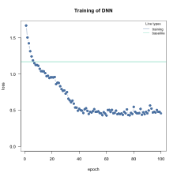
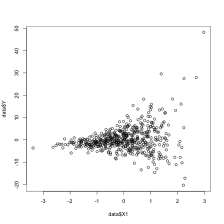
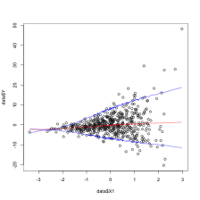
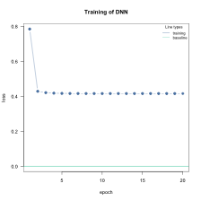

## Custom loss functions

We can pass custom loss functions to cito. R variables/values that are used within the loss function and that should be additionally optimized must be passed to cito via the custom_parameters argument in `dnn(...custom_parameters = list(name_of_parameter=...))`

Examples:

-   (Complex) likelihood functions
-   Advanced: Quantile regression

Requirements: - Complex calculations have to be written in torch - All functions/calls must have derivatives.

### Example 1: Custom (likelihood/loss) functions

Gaussian likelihood (already implemented, but still a nice example). Custom parameters must be passed as a list to the custom_parameters function. The names must match the names of the parameters in the custom loss function. The values of the named custom parameters will be the initial values. Cito will automatically convert them to torch tensors:


```r
library(cito)
library(torch)
gaussian_ll = function(pred, true, ...) {
  loss = -torch::distr_normal(pred, scale = torch::torch_exp(scale_par))$log_prob(true)
  return(loss$mean())
}

# Simulate some data
X = runif(200)
Y = 2*X + rnorm(200, sd = 0.4)
df = data.frame(X = X, Y = Y)

m = dnn(Y~X, data = df,
        loss = gaussian_ll, # custom function
        custom_parameters = list(scale_par = 0.0) # custom parameter that should be addtionally optimized
        )
#> Loss at epoch 1: 1.334335, lr: 0.01000
```



```
#> Loss at epoch 2: 1.154231, lr: 0.01000
#> Loss at epoch 3: 1.068738, lr: 0.01000
#> Loss at epoch 4: 1.016910, lr: 0.01000
#> Loss at epoch 5: 0.976305, lr: 0.01000
#> Loss at epoch 6: 0.937856, lr: 0.01000
#> Loss at epoch 7: 0.899509, lr: 0.01000
#> Loss at epoch 8: 0.863034, lr: 0.01000
#> Loss at epoch 9: 0.824331, lr: 0.01000
#> Loss at epoch 10: 0.786820, lr: 0.01000
#> Loss at epoch 11: 0.749023, lr: 0.01000
#> Loss at epoch 12: 0.716187, lr: 0.01000
#> Loss at epoch 13: 0.684993, lr: 0.01000
#> Loss at epoch 14: 0.651024, lr: 0.01000
#> Loss at epoch 15: 0.630259, lr: 0.01000
#> Loss at epoch 16: 0.602878, lr: 0.01000
#> Loss at epoch 17: 0.594161, lr: 0.01000
#> Loss at epoch 18: 0.585590, lr: 0.01000
#> Loss at epoch 19: 0.572606, lr: 0.01000
#> Loss at epoch 20: 0.596161, lr: 0.01000
#> Loss at epoch 21: 0.560749, lr: 0.01000
#> Loss at epoch 22: 0.569604, lr: 0.01000
#> Loss at epoch 23: 0.557299, lr: 0.01000
#> Loss at epoch 24: 0.562676, lr: 0.01000
#> Loss at epoch 25: 0.566415, lr: 0.01000
#> Loss at epoch 26: 0.545704, lr: 0.01000
#> Loss at epoch 27: 0.563066, lr: 0.01000
#> Loss at epoch 28: 0.579306, lr: 0.01000
#> Loss at epoch 29: 0.548550, lr: 0.01000
#> Loss at epoch 30: 0.566733, lr: 0.01000
#> Loss at epoch 31: 0.602605, lr: 0.01000
#> Loss at epoch 32: 0.566520, lr: 0.01000
#> Loss at epoch 33: 0.555276, lr: 0.01000
#> Loss at epoch 34: 0.573158, lr: 0.01000
#> Loss at epoch 35: 0.553411, lr: 0.01000
#> Loss at epoch 36: 0.562307, lr: 0.01000
#> Loss at epoch 37: 0.553605, lr: 0.01000
#> Loss at epoch 38: 0.561382, lr: 0.01000
#> Loss at epoch 39: 0.542558, lr: 0.01000
#> Loss at epoch 40: 0.555270, lr: 0.01000
#> Loss at epoch 41: 0.569742, lr: 0.01000
#> Loss at epoch 42: 0.559802, lr: 0.01000
#> Loss at epoch 43: 0.561651, lr: 0.01000
#> Loss at epoch 44: 0.550025, lr: 0.01000
#> Loss at epoch 45: 0.551257, lr: 0.01000
#> Loss at epoch 46: 0.553354, lr: 0.01000
#> Loss at epoch 47: 0.548418, lr: 0.01000
#> Loss at epoch 48: 0.572100, lr: 0.01000
#> Loss at epoch 49: 0.566985, lr: 0.01000
#> Loss at epoch 50: 0.563628, lr: 0.01000
#> Loss at epoch 51: 0.565352, lr: 0.01000
#> Loss at epoch 52: 0.557491, lr: 0.01000
#> Loss at epoch 53: 0.553377, lr: 0.01000
#> Loss at epoch 54: 0.543934, lr: 0.01000
#> Loss at epoch 55: 0.591781, lr: 0.01000
#> Loss at epoch 56: 0.551933, lr: 0.01000
#> Loss at epoch 57: 0.556685, lr: 0.01000
#> Loss at epoch 58: 0.557246, lr: 0.01000
#> Loss at epoch 59: 0.550845, lr: 0.01000
#> Loss at epoch 60: 0.568086, lr: 0.01000
#> Loss at epoch 61: 0.547975, lr: 0.01000
#> Loss at epoch 62: 0.553804, lr: 0.01000
#> Loss at epoch 63: 0.550696, lr: 0.01000
#> Loss at epoch 64: 0.553359, lr: 0.01000
#> Loss at epoch 65: 0.555588, lr: 0.01000
#> Loss at epoch 66: 0.556177, lr: 0.01000
#> Loss at epoch 67: 0.548261, lr: 0.01000
#> Loss at epoch 68: 0.575579, lr: 0.01000
#> Loss at epoch 69: 0.555330, lr: 0.01000
#> Loss at epoch 70: 0.567671, lr: 0.01000
#> Loss at epoch 71: 0.550055, lr: 0.01000
#> Loss at epoch 72: 0.542451, lr: 0.01000
#> Loss at epoch 73: 0.563940, lr: 0.01000
#> Loss at epoch 74: 0.550842, lr: 0.01000
#> Loss at epoch 75: 0.562200, lr: 0.01000
#> Loss at epoch 76: 0.557705, lr: 0.01000
#> Loss at epoch 77: 0.557986, lr: 0.01000
#> Loss at epoch 78: 0.556814, lr: 0.01000
#> Loss at epoch 79: 0.560184, lr: 0.01000
#> Loss at epoch 80: 0.548673, lr: 0.01000
#> Loss at epoch 81: 0.591368, lr: 0.01000
#> Loss at epoch 82: 0.556005, lr: 0.01000
#> Loss at epoch 83: 0.544128, lr: 0.01000
#> Loss at epoch 84: 0.585111, lr: 0.01000
#> Loss at epoch 85: 0.565595, lr: 0.01000
#> Loss at epoch 86: 0.555380, lr: 0.01000
#> Loss at epoch 87: 0.553692, lr: 0.01000
#> Loss at epoch 88: 0.554190, lr: 0.01000
#> Loss at epoch 89: 0.550925, lr: 0.01000
#> Loss at epoch 90: 0.546147, lr: 0.01000
#> Loss at epoch 91: 0.550892, lr: 0.01000
#> Loss at epoch 92: 0.560193, lr: 0.01000
#> Loss at epoch 93: 0.570056, lr: 0.01000
#> Loss at epoch 94: 0.553779, lr: 0.01000
#> Loss at epoch 95: 0.558661, lr: 0.01000
#> Loss at epoch 96: 0.546044, lr: 0.01000
#> Loss at epoch 97: 0.549163, lr: 0.01000
#> Loss at epoch 98: 0.550264, lr: 0.01000
#> Loss at epoch 99: 0.549252, lr: 0.01000
#> Loss at epoch 100: 0.562601, lr: 0.01000
```

The optimized parameters are saved in the parameter field:


```r
exp(m$parameter$scale_par) # true scale parameter: 0.4!
#> [1] 0.4217262
```

### Example 2: Quantile regression

The bootstrapping approach provides confidence intervals, but not prediction intervals. We could use likelihoods, such as the Gaussian likelihood, to fit a constant prediction interval. However, we often use loss functions, such as the mean squared error in ML/DL, which don't have an intrinsic parametrization for prediction intervals. We can approximate prediction intervals with quantile regression, which has the advantage of providing non-constant prediction intervals (for example for heteroscedasticity):

Simulate data:


```r
sim_in = function(n = 5) {
  S = diag(1., 3)
  S[1,2]=S[2,1]=0.0
  X = mvtnorm::rmvnorm(n, sigma = S)
  X1 = X[,1]
  C = X[,2]
  X2 = X[,3]
  Y = 1*X1 + 0.1*X2 + 0.0*C + rnorm(n, sd = 0.3+2*1.8^(X1+1))
  return(data.frame(Y = Y, X1 = X1, X2 = X2, C = C))
}

data = sim_in(500L)
plot(data$X1, data$Y)
```



The variance increases with higher feature values

Quantile Regression:


```r
library(torch)

q1 = torch_tensor(0.05)
q2 = torch_tensor(0.5)
q3 = torch_tensor(0.95)
loss_func = function(pred, true,...) {
  l1 = torch_max(q1*(true[,1,drop=FALSE]-pred[,1,drop=FALSE]), other = (1.0-q1)*(pred[,1,drop=FALSE]-true[,1,drop=FALSE]))
  l2 = torch_max(q2*(true[,2,drop=FALSE]-pred[,2,drop=FALSE]), other = (1.0-q2)*(pred[,2,drop=FALSE]-true[,2,drop=FALSE]))
  l3 = torch_max(q3*(true[,3,drop=FALSE]-pred[,3,drop=FALSE]), other = (1.0-q3)*(pred[,3,drop=FALSE]-true[,3,drop=FALSE]))
  return(l1+l2+l3)
}


m = dnn(cbind(Y, Y, Y)~., data = data,
        lr = 0.01,
        loss = loss_func,
        lambda = 0.000, alpha = 0.5,
        epochs = 70L, hidden = c(30L, 30L),
        activation = "selu", verbose = TRUE, plot = FALSE)
#> Loss at epoch 1: 5.470749, lr: 0.01000
#> Loss at epoch 2: 5.268569, lr: 0.01000
#> Loss at epoch 3: 5.076637, lr: 0.01000
#> Loss at epoch 4: 4.884690, lr: 0.01000
#> Loss at epoch 5: 4.684872, lr: 0.01000
#> Loss at epoch 6: 4.477314, lr: 0.01000
#> Loss at epoch 7: 4.274307, lr: 0.01000
#> Loss at epoch 8: 4.078366, lr: 0.01000
#> Loss at epoch 9: 3.909358, lr: 0.01000
#> Loss at epoch 10: 3.758730, lr: 0.01000
#> Loss at epoch 11: 3.627732, lr: 0.01000
#> Loss at epoch 12: 3.520284, lr: 0.01000
#> Loss at epoch 13: 3.424504, lr: 0.01000
#> Loss at epoch 14: 3.341247, lr: 0.01000
#> Loss at epoch 15: 3.270656, lr: 0.01000
#> Loss at epoch 16: 3.210762, lr: 0.01000
#> Loss at epoch 17: 3.154351, lr: 0.01000
#> Loss at epoch 18: 3.105250, lr: 0.01000
#> Loss at epoch 19: 3.063805, lr: 0.01000
#> Loss at epoch 20: 3.032800, lr: 0.01000
#> Loss at epoch 21: 3.005759, lr: 0.01000
#> Loss at epoch 22: 2.983023, lr: 0.01000
#> Loss at epoch 23: 2.964745, lr: 0.01000
#> Loss at epoch 24: 2.950813, lr: 0.01000
#> Loss at epoch 25: 2.935929, lr: 0.01000
#> Loss at epoch 26: 2.922020, lr: 0.01000
#> Loss at epoch 27: 2.911182, lr: 0.01000
#> Loss at epoch 28: 2.903018, lr: 0.01000
#> Loss at epoch 29: 2.894961, lr: 0.01000
#> Loss at epoch 30: 2.888757, lr: 0.01000
#> Loss at epoch 31: 2.882994, lr: 0.01000
#> Loss at epoch 32: 2.878412, lr: 0.01000
#> Loss at epoch 33: 2.874529, lr: 0.01000
#> Loss at epoch 34: 2.871417, lr: 0.01000
#> Loss at epoch 35: 2.868292, lr: 0.01000
#> Loss at epoch 36: 2.867184, lr: 0.01000
#> Loss at epoch 37: 2.863862, lr: 0.01000
#> Loss at epoch 38: 2.861748, lr: 0.01000
#> Loss at epoch 39: 2.859973, lr: 0.01000
#> Loss at epoch 40: 2.858448, lr: 0.01000
#> Loss at epoch 41: 2.856646, lr: 0.01000
#> Loss at epoch 42: 2.854968, lr: 0.01000
#> Loss at epoch 43: 2.854192, lr: 0.01000
#> Loss at epoch 44: 2.852455, lr: 0.01000
#> Loss at epoch 45: 2.851032, lr: 0.01000
#> Loss at epoch 46: 2.850336, lr: 0.01000
#> Loss at epoch 47: 2.849624, lr: 0.01000
#> Loss at epoch 48: 2.848325, lr: 0.01000
#> Loss at epoch 49: 2.846308, lr: 0.01000
#> Loss at epoch 50: 2.845728, lr: 0.01000
#> Loss at epoch 51: 2.844210, lr: 0.01000
#> Loss at epoch 52: 2.844008, lr: 0.01000
#> Loss at epoch 53: 2.842485, lr: 0.01000
#> Loss at epoch 54: 2.841521, lr: 0.01000
#> Loss at epoch 55: 2.841301, lr: 0.01000
#> Loss at epoch 56: 2.839583, lr: 0.01000
#> Loss at epoch 57: 2.839782, lr: 0.01000
#> Loss at epoch 58: 2.837819, lr: 0.01000
#> Loss at epoch 59: 2.837510, lr: 0.01000
#> Loss at epoch 60: 2.836291, lr: 0.01000
#> Loss at epoch 61: 2.835764, lr: 0.01000
#> Loss at epoch 62: 2.835144, lr: 0.01000
#> Loss at epoch 63: 2.834413, lr: 0.01000
#> Loss at epoch 64: 2.834573, lr: 0.01000
#> Loss at epoch 65: 2.832787, lr: 0.01000
#> Loss at epoch 66: 2.831882, lr: 0.01000
#> Loss at epoch 67: 2.832079, lr: 0.01000
#> Loss at epoch 68: 2.831004, lr: 0.01000
#> Loss at epoch 69: 2.829836, lr: 0.01000
#> Loss at epoch 70: 2.829776, lr: 0.01000

plot(data$X1, data$Y)
lines(smooth.spline(data$X1, predict(m)[,1], spar = 0.01), col = "blue")
lines(smooth.spline(data$X1, predict(m)[,3], spar = 0.01), col = "blue")
lines(smooth.spline(data$X1, predict(m)[,2], spar = 0.01), col = "red")
```



### Example 3: Using cito for optimization / active learning

Neural networks can be used in an unconventional way to optimize arbitrary functions (which is sometimes called active learning, it is related to reinforcement learning) - the only prerequisite is that the analytic derivative of the function using torch must be available. We provide the function to be optimized as a series of Torch operations. First, our model will predict the parameters (based on noise, the inputs don't matter) which are passed to the custom loss function and then we will then use the model function (which we optimize) to compute the loss and return it to the optimizer. In that way we overfit to the noisy inputs and the DNN will learn to predict the optimal set of parameters - independent of the input.


```r
X = runif(200)
Y = 2*X + rnorm(200, sd = 0.4)
df = data.frame(X = X, Y = Y)

# Function we want to optimize (linear model)
Xt = torch_tensor(matrix(X))
Yt = torch_tensor(matrix(Y))

model_lm = function(par) {
  pred = Xt$matmul(par[,1,drop=FALSE])
  loss = -torch::distr_normal(pred, scale = torch::torch_exp(par[,2,drop=FALSE]))$log_prob(Yt)
  return(loss$mean())
}

custom_loss = function(pred, true, ...) {
  if(nrow(pred) > 1) return(torch_zeros(1L)) # disable loss calculation
  loss = model_lm(pred)
  return(loss)
}

# X and Y values don't matter, number of columns in Y has to match the number of parameters we want to optimize
noise = matrix(runif(300*5), 300, 5)
noise_y = matrix(runif(300*2), 300, 2)
df = data.frame(y1 = noise_y[,1], y2 = noise_y[,2], noise)

m = dnn(cbind(y1, y2)~., data = df, loss = custom_loss, batchsize = 1L, epochs = 20L, verbose = FALSE)
```



```r
# Effect:
mean(predict(m)[,1])
#> [1] 2.035041
# SD
mean(exp(predict(m)[,2]))
#> [1] 0.4103649
```
