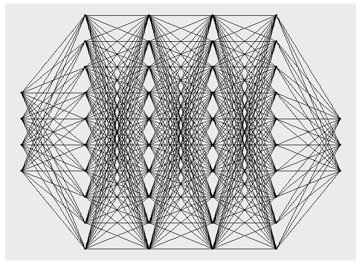
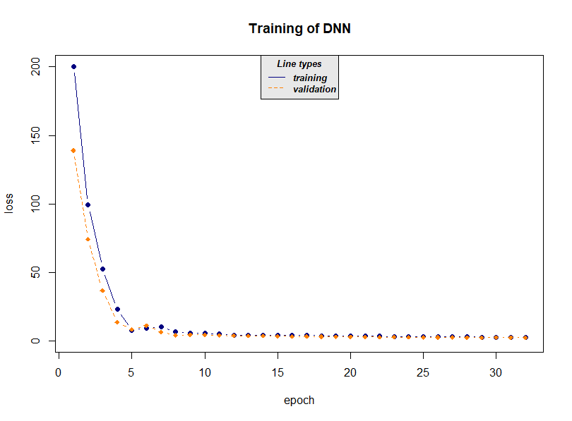

```{r, include = FALSE}
knitr::opts_chunk$set(
  collapse = TRUE,
  comment = "#>"
)
```

## Abstract
With 'cito'  you can build and train fully-connected neural networks using the formula syntax. It is based on the 'torch' deep learning framework. Since 'torch' is native to R, no Python installation or API is needed. 

## Setup 
### Installing torch 
Before using 'cito' make sure that the current version of 'torch' is installed and running. 
```{r setuptorch, eval = FALSE}
if(!require(torch)) install.packages("torch")
library(torch)
if(!torch_is_installed()) install_torch()

library (cito)

``` 
### Data
In this vignette, we will work with the irirs dataset and build a regression model.  

```{r data}
data <- datasets::iris
head(data)

#scale dataset 
data <- data.frame(scale(data[,-5]),Species = data[,5])
```

## Introduction to models and model structures 
In 'cito', you can fit neural networks with the dnn function. 
Models can also be trained on the GPU by setting device = "cuda". This is suggested if you are working with large data sets or networks. 
```{r simp_models, fig.show='hide',out.lines = 3,eval= FALSE}
library(cito)

#fitting a regression model to predict Sepal.Length
nn.fit <- dnn(Sepal.Length~. , data = data, hidden = c(10,10,10,10), epochs = 12, device = "cpu")


```
```{r print1, eval = TRUE,echo = FALSE, results = TRUE}
cat ("Loss at epoch 1: 0.906718, lr: 0.01000 
Loss at epoch 2: 0.863654, lr: 0.01000 
Loss at epoch 3: 0.843066, lr: 0.01000 
Loss at epoch 4: 0.825574, lr: 0.01000 

....  

Loss at epoch 11: 0.408130, lr: 0.01000 
Loss at epoch 12: 0.403822, lr: 0.01000 ")
```

You can plot the network structure to give you a visual feedback of the created object. Be aware that this may take some time for large networks.  
```{r plotnn, eval = FALSE}
plot(nn.fit)
```
{ width=70%}

### Adding activation functions
By default,  all layers are fitted with ReLU as activation function.
$$
relu(x) = max (0,x)
$$
You can also adjust the activation function of each layer individually to build exactly the network you want. In this case you have to provide a vector the same length as there are hidden layers. The activation function of the output layer  is chosen with the loss argument and does not have to be provided. 

```{r activation, results ="hide",fig.show='hide' ,eval = FALSE}
#selu as activation function for all layers: 
nn.fit <- dnn(Sepal.Length~., data = data, hidden = c(10,10,10,10), activation= "selu")
#layer specific activation functions: 
nn.fit <- dnn(Sepal.Length~., data = data, 
              hidden = c(10,10,10,10), activation= c("relu","selu","tanh","sigmoid"))
``` 


### Adding a validation set to the training process
In order to see where your model might start overfitting the addition of a validation set can be useful. With dnn() you can put validation = 0.x and  define a percentage that will not be used for training and only for validation after each epoch. During training, the loss plot will show you how the two losses behave. 

```{r validation, results = "hide", eval = FALSE, out.lines=3, fig.show='hide'}
#20% of data set is used as validation set
nn.fit <- dnn(Sepal.Length~., data = data, epochs = 32,
              loss= "mae", hidden = c(10,10,10,10), validation = 0.2)
```
```{r print 4, echo= FALSE, results = TRUE}
cat("Loss at epoch 1: training: 5.868, validation: 5.621, lr: 0.01000
Loss at epoch 2: training: 5.464, validation: 4.970, lr: 0.01000
Loss at epoch 3: training: 4.471, validation: 3.430, lr: 0.01000
Loss at epoch 4: training: 2.220, validation: 0.665, lr: 0.01000

... 


Loss at epoch 31: training: 0.267, validation: 0.277, lr: 0.01000
Loss at epoch 32: training: 0.265, validation: 0.275, lr: 0.01000")
```

{width=70%}

We can choose the model with minimal validation loss with the  nn.fit$use_model_epoch argument. 
```{r epoch1,eval = FALSE}
nn.fit$use_model_epoch <- which.min(nn.fit$losses$valid_l)
```

### Interpreting model output
The standard generic functions can be used to interpret the model: 


```{r interpret,eval=FALSE}
#utilize model on new data 
predict(nn.fit,data[1:3,])
```
```{r print5, eval = TRUE, echo = FALSE, results = TRUE}
cat("         [,1]
[1,] 5.046695
[2,] 4.694821
[3,] 4.788142
")


```

```{r coef, eval = FALSE}
#returns weights of neural network
coef(nn.fit)
```
```{r print2, eval = TRUE, echo = FALSE, results = TRUE}
cat("[[1]] 
[[1]]$`0.weight` 
            [,1]        [,2]        [,3]        [,4]        [,5]        [,6] 
[1,]  0.21469544  0.17144544  0.06233330  0.05737647 -0.56643492  0.30539653 
[2,]  0.02309913  0.32601142 -0.04106455 -0.05251846  0.06156364 -0.16903549 
[3,]  0.02779424 -0.39305094  0.22446594 -0.11260942  0.40277928 -0.14661779 
[4,] -0.17715086 -0.34669805  0.41711944 -0.07970788  0.28087401 -0.32001352 
[5,]  0.10428729  0.46002910  0.12490098 -0.25849682 -0.49987957 -0.19863304 
[6,]  0.08653354  0.02208819 -0.18835779 -0.18991815 -0.19675359 -0.37495106 
[7,]  0.28858119  0.02029459 -0.40138969 -0.39148667 -0.29556298  0.17978610 
[8,]  0.34569272 -0.04052169  0.76198137  0.31320053 -0.06051779  0.34071702 
[9,]  0.34511277 -0.42506409 -0.50092584 -0.22993636  0.05683114  0.38136607 
[10,] -0.13597916  0.25648212 -0.08427665 -0.46611786  0.14236088  0.04671739 

... 
 
[[1]]$`8.bias` 
[1] 0.2862495 ")
```

With summary(), the feature Importance based on [Fisher, Rudin, and Dominici (2018)](https://arxiv.org/abs/1801.01489) gets calculated for all variables.
```{r summary,eval = FALSE}
# Calculate and return feature importance
summary(nn.fit)
```
```{r print3, eval = TRUE,echo = FALSE, results = TRUE}
cat( "Deep Neural Network Model summary
Feature Importance:
     variable importance
1  Sepal.Width   3.373757
2 Petal.Length   3.090394
3  Petal.Width   2.992742
4      Species   3.278064")
```


## Training hyperparameters  
### Regularization 
#### Elastic net regularization
If elastic net is used, 'cito' will produce a sparse, generalized neural network. The L1/L2 loss can be  controlled with the arguments alpha and lambda.

$$
 loss = \lambda * [ (1 - \alpha) * |weights| + \alpha |weights|^2 ]
$$

If a single alpha value is provided each layer will get regularized the same. You can also regularize each layer individually by providing a vector of alpha values the same length as there are hidden layers + 1, the +1 comes from the input layer. With NA you can turn off generalization for specific layers.

```{r alpha, results ="hide",fig.show='hide',eval = FALSE }
#elastic net penalty in all layers: 
nn.fit <- dnn(Species~., data = data, hidden = c(10,10,10,10), alpha = 0.5, lambda = 0.01)
#L1 generalization in the first layer no penalty on the other layers: 
nn.fit <- dnn(Species~., data = data, hidden = c(10,10,10,10), 
              alpha = c(0,NA,NA,NA,NA), lambda = 0.01)
``` 

#### Dropout Regularization 
Dropout also regularizes your network. During training in every epoch a defined percentage of nodes gets left out.


```{r dropout, results ="hide",fig.show='hide' ,eval = FALSE}
#dropout of 35% on all layers: 
nn.fit <- dnn(Species~., data = data, hidden = c(10,10,10,10), dropout = 0.35)
#dropout of 35% only on last 2 layers: 
nn.fit <- dnn(Species~., data = data, 
              hidden = c(10,10,10,10), dropout = c(0, 0, 0.35, 0.35))
``` 

### Learning rate
### Learning rate scheduler
Learning rate scheduler allow you to start with a high learning rate and decrease it during the training process. 
You can choose between different types of schedulers. Namely, lambda, multiplicative, one_cycle and step.

The function config_lr_scheduler() helps you setup such a scheduler. See ?config_lr_scheduler() for more information

```{r lr_scheduler,eval = FALSE}
# Step Learning rate scheduler that reduces learning rate every 16 steps by a factor of 0.5
scheduler <- config_lr_scheduler(type = "step",
                                 step_size = 16,
                                 0.5) 

nn.fit <- dnn(Sepal.Length~., data = data,lr = 0.01, lr_scheduler= scheduler)
```


### Optimizer 
Optimizer are responsible for fitting the neural network. The optimizer tries to minimize the loss function. As default the stochastic gradient descent is used. Custom  optimizers can be used  with config_optimizer().  
See ?config_optimizer() for more information.

```{r optim,eval = FALSE}

# adam optimizer with learning rate 0.002, betas to 0.95, 0.999 and eps to 1.5e-08
opt <- config_optimizer(
  type = "adam", 
  betas = c(0.95, 0.999), 
  eps = 1.5e-08)

nn.fit <- dnn(Species~., data = data, optimizer = opt, lr=0.002)
```

### Loss functions 
Loss function measure how good the network performs. 
Standard Loss functions  are implemented along with some probability distributions. 
```{r lossfkt, eval = FALSE}
# Real Mean squared error
nn.fit <- dnn(Sepal.Length~. data = data, loss = "rmse") 

# normal distribution 
nn.fit <- dnn(Sepal.Length~. data = data, loss = stats::gaussian()) 
```


### Early Stopping 
Adding early stopping criteria helps you save time by stopping the training process early, if the validation loss of the current epoch is bigger than the validation loss n epochs early. The n can be defined by the early_stopping argument. It is required to set validation > 0. 
```{r early_stopping,eval = FALSE}
# Stops training if validation loss at current epoch is bigger than that 15 epochs earlier  
nn.fit <- dnn(Sepal.Length~., data = data, epochs = 1000, 
              validation = 0.2, early_stopping = 15)
```


## Continue training process
You can continue the training process of an existing model with continue_training(). 

```{r continue_training,eval = FALSE, fig.show='hide',out.lines = 3}
# simple example, simply adding another 12 epochs to the training process   
nn.fit <- continue_training(nn.fit, epochs = 12)
```
It also allows you to change any training parameters, for example the learning rate. You can also define which epoch the training should continue from. You can analyze the training process with analyze_training() and pick an epoch from which on the training should be continued from. 

```{r continue_training2,eval = FALSE, fig.show='hide', out.lines = 3}

# picking the model with the smalles validation loss 
# with changed parameters, in this case a smaller learning rate and a smaller batchsize
nn.fit <- continue_training(nn.fit, 
                            continue_from = which.min(nn.fit$losses$valid_l), 
                            epochs = 32, 
                            changed_params = list(lr = 0.001, batchsize = 16))
```


